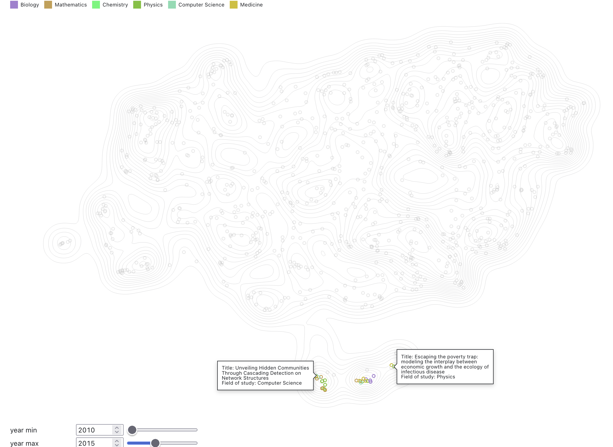
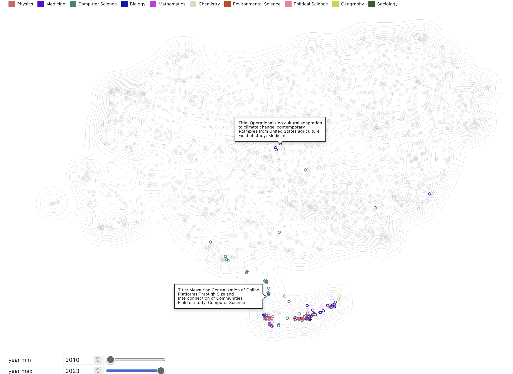

# Scientific Trajectory

In this collection of notebooks, we examine interaction in patterns of collaboration and scientific paper publication. 
We are interested in finding how latent groups and collaboration in science are impacting the type of science we do.
We will define what we means by collaboration and groups as we go along, but we can start with an example.

Here is an individual scientific trajectory contrasting number of publications and coauthors:

On the left, each dot represents a coauthor, while on the right each dot represent a paper. 
The coauthor number is how many times <ins>ego</ins> (here [Laurent Hébert‐Dufresne](https://openalex.org/authors/a5035455593)) collaborated with that individual at all times.
The dot color represents whether there is shared affiliation between ego and the coauthor at that time.
We use a simple heuristics to determine affiliation; 
 - main affiliation is the institution that appears the most often in author's paper within a given year;
 - if coauthor and ego share their main institution, color with the same color.
Sometimes, we can have a good idea of ego's career trajectory by just looking at that information.
Here ego started at Université Laval, did a PostDoc at the Santa Fe Institute, then got a position at University of Vermont where we started his research lab.

We can also look at how the social and producitivity trajectory correlate with topical exploration by ego. 
Here we use SPECTER2's <ins>scientific document embedding</ins> to look at how career trajectory maps onto topic exploration.
We can look at, for example, where did ego started by looking at his student's years:

We see that the early year was concentrated on the physics of network and some early epidimiology. 
We can compare early years with later years, where we already know he has new collaborations:

One of the most notable changes is how the ego is moving into computer science land. 
There are many reasons this might be the case. 
Part of it is due to ego's new PhD students that are more into computer science than physics or epidemiology.
The funding stream might be also a driver of that attraction towards that space.
There has been also foray into the intersection of climate change and public health.

Yet another way to look at the change in collaboration patterns is to visualize collaborations as hyperedges:

Here, orange dots are coauthors with shared affiliation, as in the first figure. 
We only show papers with at least another person that share the same affiliation than ego, to focus on what we refer to as <ins>local works</ins>.
We can see that the collaboration patterns change drastically after 2019, but there might be competing causes.
We know ego became a professors at University of Vermont, but he is also involved heavily in epidemiological modeling.
As we know, 2019-2020 COVID-19 was in full swing. 

We can also see the degree to which ego's PhD was collaborative, with darker hyperedges indicating multiple collaboration with the same subset of coauthors.

## Scientific career trajectories 

Do the patterns observed in the previous section are typical? 
We can put side by side researchers, and start investigating the question. 
Here are 4 researchers in complex systems who are all under 11 years of academic age. 

<svg class="plot-d6a7b5" fill="currentColor" font-family="system-ui, sans-serif" font-size="10" text-anchor="middle" width="1000" height="1350" viewBox="0 0 1000 1350" style="overflow: visible;"><g aria-label="fx-axis tick label" transform="translate(0.5,-8.5)"><g transform="translate(1,0)"><text transform="translate(231,30)">Alec Kirkley-coauthor</text></g><g transform="translate(209,0)"><text transform="translate(231,30)">Alec Kirkley-paper</text></g><g transform="translate(417,0)"><text transform="translate(231,30)">Brooke Foucault Welles-coauthor</text></g><g transform="translate(625,0)"><text transform="translate(231,30)">Brooke Foucault Welles-paper</text></g><g transform="translate(833,0)"><text transform="translate(231,30)">Jean-Gabriel Young-coauthor</text></g><g transform="translate(1041,0)"><text transform="translate(231,30)">Jean-Gabriel Young-paper</text></g><g transform="translate(1249,0)"><text transform="translate(231,30)">Márton Pósfai-coauthor</text></g><g transform="translate(1457,0)"><text transform="translate(231,30)">Márton Pósfai-paper</text></g></g><g aria-label="y-grid" transform="translate(0,0.5)"><g stroke="currentColor" stroke-opacity="0.1" transform="translate(1,0)"><line x1="130" x2="332" y1="1272.3003802281369" y2="1272.3003802281369"></line><line x1="130" x2="332" y1="1246.0646387832699" y2="1246.0646387832699"></line><line x1="130" x2="332" y1="1220.1140684410645" y2="1220.1140684410645"></line><line x1="130" x2="332" y1="1194.4486692015207" y2="1194.4486692015207"></line><line x1="130" x2="332" y1="1168.212927756654" y2="1168.212927756654"></line><line x1="130" x2="332" y1="1141.9771863117871" y2="1141.9771863117871"></line><line x1="130" x2="332" y1="1116.0266159695816" y2="1116.0266159695816"></line><line x1="130" x2="332" y1="1090.361216730038" y2="1090.361216730038"></line><line x1="130" x2="332" y1="1064.125475285171" y2="1064.125475285171"></line><line x1="130" x2="332" y1="1037.8897338403042" y2="1037.8897338403042"></line><line x1="130" x2="332" y1="1011.9391634980989" y2="1011.9391634980989"></line><line x1="130" x2="332" y1="986.2737642585552" y2="986.2737642585552"></line><line x1="130" x2="332" y1="960.0380228136881" y2="960.0380228136881"></line><line x1="130" x2="332" y1="933.8022813688214" y2="933.8022813688214"></line><line x1="130" x2="332" y1="907.851711026616" y2="907.851711026616"></line><line x1="130" x2="332" y1="881.9011406844106" y2="881.9011406844106"></line><line x1="130" x2="332" y1="855.6653992395437" y2="855.6653992395437"></line><line x1="130" x2="332" y1="829.4296577946769" y2="829.4296577946769"></line><line x1="130" x2="332" y1="803.4790874524715" y2="803.4790874524715"></line><line x1="130" x2="332" y1="777.8136882129279" y2="777.8136882129279"></line><line x1="130" x2="332" y1="751.5779467680609" y2="751.5779467680609"></line><line x1="130" x2="332" y1="725.3422053231939" y2="725.3422053231939"></line><line x1="130" x2="332" y1="699.3916349809887" y2="699.3916349809887"></line><line x1="130" x2="332" y1="673.726235741445" y2="673.726235741445"></line><line x1="130" x2="332" y1="647.4904942965778" y2="647.4904942965778"></line><line x1="130" x2="332" y1="621.254752851711" y2="621.254752851711"></line><line x1="130" x2="332" y1="595.3041825095056" y2="595.3041825095056"></line><line x1="130" x2="332" y1="569.638783269962" y2="569.638783269962"></line><line x1="130" x2="332" y1="543.4030418250951" y2="543.4030418250951"></line><line x1="130" x2="332" y1="517.1673003802282" y2="517.1673003802282"></line><line x1="130" x2="332" y1="491.2167300380228" y2="491.2167300380228"></line><line x1="130" x2="332" y1="465.26615969581746" y2="465.26615969581746"></line><line x1="130" x2="332" y1="439.03041825095056" y2="439.03041825095056"></line><line x1="130" x2="332" y1="412.79467680608366" y2="412.79467680608366"></line><line x1="130" x2="332" y1="386.84410646387835" y2="386.84410646387835"></line><line x1="130" x2="332" y1="361.1787072243346" y2="361.1787072243346"></line><line x1="130" x2="332" y1="334.9429657794677" y2="334.9429657794677"></line><line x1="130" x2="332" y1="308.70722433460077" y2="308.70722433460077"></line><line x1="130" x2="332" y1="282.7566539923954" y2="282.7566539923954"></line><line x1="130" x2="332" y1="257.0912547528517" y2="257.0912547528517"></line><line x1="130" x2="332" y1="230.85551330798478" y2="230.85551330798478"></line><line x1="130" x2="332" y1="204.61977186311788" y2="204.61977186311788"></line><line x1="130" x2="332" y1="178.66920152091254" y2="178.66920152091254"></line><line x1="130" x2="332" y1="153.00380228136882" y2="153.00380228136882"></line><line x1="130" x2="332" y1="126.76806083650189" y2="126.76806083650189"></line><line x1="130" x2="332" y1="100.53231939163499" y2="100.53231939163499"></line></g><g stroke="currentColor" stroke-opacity="0.1" transform="translate(209,0)"><line x1="130" x2="332" y1="1272.3003802281369" y2="1272.3003802281369"></line><line x1="130" x2="332" y1="1246.0646387832699" y2="1246.0646387832699"></line><line x1="130" x2="332" y1="1220.1140684410645" y2="1220.1140684410645"></line><line x1="130" x2="332" y1="1194.4486692015207" y2="1194.4486692015207"></line><line x1="130" x2="332" y1="1168.212927756654" y2="1168.212927756654"></line><line x1="130" x2="332" y1="1141.9771863117871" y2="1141.9771863117871"></line><line x1="130" x2="332" y1="1116.0266159695816" y2="1116.0266159695816"></line><line x1="130" x2="332" y1="1090.361216730038" y2="1090.361216730038"></line><line x1="130" x2="332" y1="1064.125475285171" y2="1064.125475285171"></line><line x1="130" x2="332" y1="1037.8897338403042" y2="1037.8897338403042"></line><line x1="130" x2="332" y1="1011.9391634980989" y2="1011.9391634980989"></line><line x1="130" x2="332" y1="986.2737642585552" y2="986.2737642585552"></line><line x1="130" x2="332" y1="960.0380228136881" y2="960.0380228136881"></line><line x1="130" x2="332" y1="933.8022813688214" y2="933.8022813688214"></line><line x1="130" x2="332" y1="907.851711026616" y2="907.851711026616"></line><line x1="130" x2="332" y1="881.9011406844106" y2="881.9011406844106"></line><line x1="130" x2="332" y1="855.6653992395437" y2="855.6653992395437"></line><line x1="130" x2="332" y1="829.4296577946769" y2="829.4296577946769"></line><line x1="130" x2="332" y1="803.4790874524715" y2="803.4790874524715"></line><line x1="130" x2="332" y1="777.8136882129279" y2="777.8136882129279"></line><line x1="130" x2="332" y1="751.5779467680609" y2="751.5779467680609"></line><line x1="130" x2="332" y1="725.3422053231939" y2="725.3422053231939"></line><line x1="130" x2="332" y1="699.3916349809887" y2="699.3916349809887"></line><line x1="130" x2="332" y1="673.726235741445" y2="673.726235741445"></line><line x1="130" x2="332" y1="647.4904942965778" y2="647.4904942965778"></line><line x1="130" x2="332" y1="621.254752851711" y2="621.254752851711"></line><line x1="130" x2="332" y1="595.3041825095056" y2="595.3041825095056"></line><line x1="130" x2="332" y1="569.638783269962" y2="569.638783269962"></line><line x1="130" x2="332" y1="543.4030418250951" y2="543.4030418250951"></line><line x1="130" x2="332" y1="517.1673003802282" y2="517.1673003802282"></line><line x1="130" x2="332" y1="491.2167300380228" y2="491.2167300380228"></line><line x1="130" x2="332" y1="465.26615969581746" y2="465.26615969581746"></line><line x1="130" x2="332" y1="439.03041825095056" y2="439.03041825095056"></line><line x1="130" x2="332" y1="412.79467680608366" y2="412.79467680608366"></line><line x1="130" x2="332" y1="386.84410646387835" y2="386.84410646387835"></line><line x1="130" x2="332" y1="361.1787072243346" y2="361.1787072243346"></line><line x1="130" x2="332" y1="334.9429657794677" y2="334.9429657794677"></line><line x1="130" x2="332" y1="308.70722433460077" y2="308.70722433460077"></line><line x1="130" x2="332" y1="282.7566539923954" y2="282.7566539923954"></line><line x1="130" x2="332" y1="257.0912547528517" y2="257.0912547528517"></line><line x1="130" x2="332" y1="230.85551330798478" y2="230.85551330798478"></line><line x1="130" x2="332" y1="204.61977186311788" y2="204.61977186311788"></line><line x1="130" x2="332" y1="178.66920152091254" y2="178.66920152091254"></line><line x1="130" x2="332" y1="153.00380228136882" y2="153.00380228136882"></line><line x1="130" x2="332" y1="126.76806083650189" y2="126.76806083650189"></line><line x1="130" x2="332" y1="100.53231939163499" y2="100.53231939163499"></line></g><g stroke="currentColor" stroke-opacity="0.1" transform="translate(417,0)"><line x1="130" x2="332" y1="1272.3003802281369" y2="1272.3003802281369"></line><line x1="130" x2="332" y1="1246.0646387832699" y2="1246.0646387832699"></line><line x1="130" x2="332" y1="1220.1140684410645" y2="1220.1140684410645"></line><line x1="130" x2="332" y1="1194.4486692015207" y2="1194.4486692015207"></line><line x1="130" x2="332" y1="1168.212927756654" y2="1168.212927756654"></line><line x1="130" x2="332" y1="1141.9771863117871" y2="1141.9771863117871"></line><line x1="130" x2="332" y1="1116.0266159695816" y2="1116.0266159695816"></line><line x1="130" x2="332" y1="1090.361216730038" y2="1090.361216730038"></line><line x1="130" x2="332" y1="1064.125475285171" y2="1064.125475285171"></line><line x1="130" x2="332" y1="1037.8897338403042" y2="1037.8897338403042"></line><line x1="130" x2="332" y1="1011.9391634980989" y2="1011.9391634980989"></line><line x1="130" x2="332" y1="986.2737642585552" y2="986.2737642585552"></line><line x1="130" x2="332" y1="960.0380228136881" y2="960.0380228136881"></line><line x1="130" x2="332" y1="933.8022813688214" y2="933.8022813688214"></line><line x1="130" x2="332" y1="907.851711026616" y2="907.851711026616"></line><line x1="130" x2="332" y1="881.9011406844106" y2="881.9011406844106"></line><line x1="130" x2="332" y1="855.6653992395437" y2="855.6653992395437"></line><line x1="130" x2="332" y1="829.4296577946769" y2="829.4296577946769"></line><line x1="130" x2="332" y1="803.4790874524715" y2="803.4790874524715"></line><line x1="130" x2="332" y1="777.8136882129279" y2="777.8136882129279"></line><line x1="130" x2="332" y1="751.5779467680609" y2="751.5779467680609"></line><line x1="130" x2="332" y1="725.3422053231939" y2="725.3422053231939"></line><line x1="130" x2="332" y1="699.3916349809887" y2="699.3916349809887"></line><line x1="130" x2="332" y1="673.726235741445" y2="673.726235741445"></line><line x1="130" x2="332" y1="647.4904942965778" y2="647.4904942965778"></line><line x1="130" x2="332" y1="621.254752851711" y2="621.254752851711"></line><line x1="130" x2="332" y1="595.3041825095056" y2="595.3041825095056"></line><line x1="130" x2="332" y1="569.638783269962" y2="569.638783269962"></line><line x1="130" x2="332" y1="543.4030418250951" y2="543.4030418250951"></line><line x1="130" x2="332" y1="517.1673003802282" y2="517.1673003802282"></line><line x1="130" x2="332" y1="491.2167300380228" y2="491.2167300380228"></line><line x1="130" x2="332" y1="465.26615969581746" y2="465.26615969581746"></line><line x1="130" x2="332" y1="439.03041825095056" y2="439.03041825095056"></line><line x1="130" x2="332" y1="412.79467680608366" y2="412.79467680608366"></line><line x1="130" x2="332" y1="386.84410646387835" y2="386.84410646387835"></line><line x1="130" x2="332" y1="361.1787072243346" y2="361.1787072243346"></line><line x1="130" x2="332" y1="334.9429657794677" y2="334.9429657794677"></line><line x1="130" x2="332" y1="308.70722433460077" y2="308.70722433460077"></line><line x1="130" x2="332" y1="282.7566539923954" y2="282.7566539923954"></line><line x1="130" x2="332" y1="257.0912547528517" y2="257.0912547528517"></line><line x1="130" x2="332" y1="230.85551330798478" y2="230.85551330798478"></line><line x1="130" x2="332" y1="204.61977186311788" y2="204.61977186311788"></line><line x1="130" x2="332" y1="178.66920152091254" y2="178.66920152091254"></line><line x1="130" x2="332" y1="153.00380228136882" y2="153.00380228136882"></line><line x1="130" x2="332" y1="126.76806083650189" y2="126.76806083650189"></line><line x1="130" x2="332" y1="100.53231939163499" y2="100.53231939163499"></line></g><g stroke="currentColor" stroke-opacity="0.1" transform="translate(625,0)"><line x1="130" x2="332" y1="1272.3003802281369" y2="1272.3003802281369"></line><line x1="130" x2="332" y1="1246.0646387832699" y2="1246.0646387832699"></line><line x1="130" x2="332" y1="1220.1140684410645" y2="1220.1140684410645"></line><line x1="130" x2="332" y1="1194.4486692015207" y2="1194.4486692015207"></line><line x1="130" x2="332" y1="1168.212927756654" y2="1168.212927756654"></line><line x1="130" x2="332" y1="1141.9771863117871" y2="1141.9771863117871"></line><line x1="130" x2="332" y1="1116.0266159695816" y2="1116.0266159695816"></line><line x1="130" x2="332" y1="1090.361216730038" y2="1090.361216730038"></line><line x1="130" x2="332" y1="1064.125475285171" y2="1064.125475285171"></line><line x1="130" x2="332" y1="1037.8897338403042" y2="1037.8897338403042"></line><line x1="130" x2="332" y1="1011.9391634980989" y2="1011.9391634980989"></line><line x1="130" x2="332" y1="986.2737642585552" y2="986.2737642585552"></line><line x1="130" x2="332" y1="960.0380228136881" y2="960.0380228136881"></line><line x1="130" x2="332" y1="933.8022813688214" y2="933.8022813688214"></line><line x1="130" x2="332" y1="907.851711026616" y2="907.851711026616"></line><line x1="130" x2="332" y1="881.9011406844106" y2="881.9011406844106"></line><line x1="130" x2="332" y1="855.6653992395437" y2="855.6653992395437"></line><line x1="130" x2="332" y1="829.4296577946769" y2="829.4296577946769"></line><line x1="130" x2="332" y1="803.4790874524715" y2="803.4790874524715"></line><line x1="130" x2="332" y1="777.8136882129279" y2="777.8136882129279"></line><line x1="130" x2="332" y1="751.5779467680609" y2="751.5779467680609"></line><line x1="130" x2="332" y1="725.3422053231939" y2="725.3422053231939"></line><line x1="130" x2="332" y1="699.3916349809887" y2="699.3916349809887"></line><line x1="130" x2="332" y1="673.726235741445" y2="673.726235741445"></line><line x1="130" x2="332" y1="647.4904942965778" y2="647.4904942965778"></line><line x1="130" x2="332" y1="621.254752851711" y2="621.254752851711"></line><line x1="130" x2="332" y1="595.3041825095056" y2="595.3041825095056"></line><line x1="130" x2="332" y1="569.638783269962" y2="569.638783269962"></line><line x1="130" x2="332" y1="543.4030418250951" y2="543.4030418250951"></line><line x1="130" x2="332" y1="517.1673003802282" y2="517.1673003802282"></line><line x1="130" x2="332" y1="491.2167300380228" y2="491.2167300380228"></line><line x1="130" x2="332" y1="465.26615969581746" y2="465.26615969581746"></line><line x1="130" x2="332" y1="439.03041825095056" y2="439.03041825095056"></line><line x1="130" x2="332" y1="412.79467680608366" y2="412.79467680608366"></line><line x1="130" x2="332" y1="386.84410646387835" y2="386.84410646387835"></line><line x1="130" x2="332" y1="361.1787072243346" y2="361.1787072243346"></line><line x1="130" x2="332" y1="334.9429657794677" y2="334.9429657794677"></line><line x1="130" x2="332" y1="308.70722433460077" y2="308.70722433460077"></line><line x1="130" x2="332" y1="282.7566539923954" y2="282.7566539923954"></line><line x1="130" x2="332" y1="257.0912547528517" y2="257.0912547528517"></line><line x1="130" x2="332" y1="230.85551330798478" y2="230.85551330798478"></line><line x1="130" x2="332" y1="204.61977186311788" y2="204.61977186311788"></line><line x1="130" x2="332" y1="178.66920152091254" y2="178.66920152091254"></line><line x1="130" x2="332" y1="153.00380228136882" y2="153.00380228136882"></line><line x1="130" x2="332" y1="126.76806083650189" y2="126.76806083650189"></line><line x1="130" x2="332" y1="100.53231939163499" y2="100.53231939163499"></line></g><g stroke="currentColor" stroke-opacity="0.1" transform="translate(833,0)"><line x1="130" x2="332" y1="1272.3003802281369" y2="1272.3003802281369"></line><line x1="130" x2="332" y1="1246.0646387832699" y2="1246.0646387832699"></line><line x1="130" x2="332" y1="1220.1140684410645" y2="1220.1140684410645"></line><line x1="130" x2="332" y1="1194.4486692015207" y2="1194.4486692015207"></line><line x1="130" x2="332" y1="1168.212927756654" y2="1168.212927756654"></line><line x1="130" x2="332" y1="1141.9771863117871" y2="1141.9771863117871"></line><line x1="130" x2="332" y1="1116.0266159695816" y2="1116.0266159695816"></line><line x1="130" x2="332" y1="1090.361216730038" y2="1090.361216730038"></line><line x1="130" x2="332" y1="1064.125475285171" y2="1064.125475285171"></line><line x1="130" x2="332" y1="1037.8897338403042" y2="1037.8897338403042"></line><line x1="130" x2="332" y1="1011.9391634980989" y2="1011.9391634980989"></line><line x1="130" x2="332" y1="986.2737642585552" y2="986.2737642585552"></line><line x1="130" x2="332" y1="960.0380228136881" y2="960.0380228136881"></line><line x1="130" x2="332" y1="933.8022813688214" y2="933.8022813688214"></line><line x1="130" x2="332" y1="907.851711026616" y2="907.851711026616"></line><line x1="130" x2="332" y1="881.9011406844106" y2="881.9011406844106"></line><line x1="130" x2="332" y1="855.6653992395437" y2="855.6653992395437"></line><line x1="130" x2="332" y1="829.4296577946769" y2="829.4296577946769"></line><line x1="130" x2="332" y1="803.4790874524715" y2="803.4790874524715"></line><line x1="130" x2="332" y1="777.8136882129279" y2="777.8136882129279"></line><line x1="130" x2="332" y1="751.5779467680609" y2="751.5779467680609"></line><line x1="130" x2="332" y1="725.3422053231939" y2="725.3422053231939"></line><line x1="130" x2="332" y1="699.3916349809887" y2="699.3916349809887"></line><line x1="130" x2="332" y1="673.726235741445" y2="673.726235741445"></line><line x1="130" x2="332" y1="647.4904942965778" y2="647.4904942965778"></line><line x1="130" x2="332" y1="621.254752851711" y2="621.254752851711"></line><line x1="130" x2="332" y1="595.3041825095056" y2="595.3041825095056"></line><line x1="130" x2="332" y1="569.638783269962" y2="569.638783269962"></line><line x1="130" x2="332" y1="543.4030418250951" y2="543.4030418250951"></line><line x1="130" x2="332" y1="517.1673003802282" y2="517.1673003802282"></line><line x1="130" x2="332" y1="491.2167300380228" y2="491.2167300380228"></line><line x1="130" x2="332" y1="465.26615969581746" y2="465.26615969581746"></line><line x1="130" x2="332" y1="439.03041825095056" y2="439.03041825095056"></line><line x1="130" x2="332" y1="412.79467680608366" y2="412.79467680608366"></line><line x1="130" x2="332" y1="386.84410646387835" y2="386.84410646387835"></line><line x1="130" x2="332" y1="361.1787072243346" y2="361.1787072243346"></line><line x1="130" x2="332" y1="334.9429657794677" y2="334.9429657794677"></line><line x1="130" x2="332" y1="308.70722433460077" y2="308.70722433460077"></line><line x1="130" x2="332" y1="282.7566539923954" y2="282.7566539923954"></line><line x1="130" x2="332" y1="257.0912547528517" y2="257.0912547528517"></line><line x1="130" x2="332" y1="230.85551330798478" y2="230.85551330798478"></line><line x1="130" x2="332" y1="204.61977186311788" y2="204.61977186311788"></line><line x1="130" x2="332" y1="178.66920152091254" y2="178.66920152091254"></line><line x1="130" x2="332" y1="153.00380228136882" y2="153.00380228136882"></line><line x1="130" x2="332" y1="126.76806083650189" y2="126.76806083650189"></line><line x1="130" x2="332" y1="100.53231939163499" y2="100.53231939163499"></line></g><g stroke="currentColor" stroke-opacity="0.1" transform="translate(1041,0)"><line x1="130" x2="332" y1="1272.3003802281369" y2="1272.3003802281369"></line><line x1="130" x2="332" y1="1246.0646387832699" y2="1246.0646387832699"></line><line x1="130" x2="332" y1="1220.1140684410645" y2="1220.1140684410645"></line><line x1="130" x2="332" y1="1194.4486692015207" y2="1194.4486692015207"></line><line x1="130" x2="332" y1="1168.212927756654" y2="1168.212927756654"></line><line x1="130" x2="332" y1="1141.9771863117871" y2="1141.9771863117871"></line><line x1="130" x2="332" y1="1116.0266159695816" y2="1116.0266159695816"></line><line x1="130" x2="332" y1="1090.361216730038" y2="1090.361216730038"></line><line x1="130" x2="332" y1="1064.125475285171" y2="1064.125475285171"></line><line x1="130" x2="332" y1="1037.8897338403042" y2="1037.8897338403042"></line><line x1="130" x2="332" y1="1011.9391634980989" y2="1011.9391634980989"></line><line x1="130" x2="332" y1="986.2737642585552" y2="986.2737642585552"></line><line x1="130" x2="332" y1="960.0380228136881" y2="960.0380228136881"></line><line x1="130" x2="332" y1="933.8022813688214" y2="933.8022813688214"></line><line x1="130" x2="332" y1="907.851711026616" y2="907.851711026616"></line><line x1="130" x2="332" y1="881.9011406844106" y2="881.9011406844106"></line><line x1="130" x2="332" y1="855.6653992395437" y2="855.6653992395437"></line><line x1="130" x2="332" y1="829.4296577946769" y2="829.4296577946769"></line><line x1="130" x2="332" y1="803.4790874524715" y2="803.4790874524715"></line><line x1="130" x2="332" y1="777.8136882129279" y2="777.8136882129279"></line><line x1="130" x2="332" y1="751.5779467680609" y2="751.5779467680609"></line><line x1="130" x2="332" y1="725.3422053231939" y2="725.3422053231939"></line><line x1="130" x2="332" y1="699.3916349809887" y2="699.3916349809887"></line><line x1="130" x2="332" y1="673.726235741445" y2="673.726235741445"></line><line x1="130" x2="332" y1="647.4904942965778" y2="647.4904942965778"></line><line x1="130" x2="332" y1="621.254752851711" y2="621.254752851711"></line><line x1="130" x2="332" y1="595.3041825095056" y2="595.3041825095056"></line><line x1="130" x2="332" y1="569.638783269962" y2="569.638783269962"></line><line x1="130" x2="332" y1="543.4030418250951" y2="543.4030418250951"></line><line x1="130" x2="332" y1="517.1673003802282" y2="517.1673003802282"></line><line x1="130" x2="332" y1="491.2167300380228" y2="491.2167300380228"></line><line x1="130" x2="332" y1="465.26615969581746" y2="465.26615969581746"></line><line x1="130" x2="332" y1="439.03041825095056" y2="439.03041825095056"></line><line x1="130" x2="332" y1="412.79467680608366" y2="412.79467680608366"></line><line x1="130" x2="332" y1="386.84410646387835" y2="386.84410646387835"></line><line x1="130" x2="332" y1="361.1787072243346" y2="361.1787072243346"></line><line x1="130" x2="332" y1="334.9429657794677" y2="334.9429657794677"></line><line x1="130" x2="332" y1="308.70722433460077" y2="308.70722433460077"></line><line x1="130" x2="332" y1="282.7566539923954" y2="282.7566539923954"></line><line x1="130" x2="332" y1="257.0912547528517" y2="257.0912547528517"></line><line x1="130" x2="332" y1="230.85551330798478" y2="230.85551330798478"></line><line x1="130" x2="332" y1="204.61977186311788" y2="204.61977186311788"></line><line x1="130" x2="332" y1="178.66920152091254" y2="178.66920152091254"></line><line x1="130" x2="332" y1="153.00380228136882" y2="153.00380228136882"></line><line x1="130" x2="332" y1="126.76806083650189" y2="126.76806083650189"></line><line x1="130" x2="332" y1="100.53231939163499" y2="100.53231939163499"></line></g><g stroke="currentColor" stroke-opacity="0.1" transform="translate(1249,0)"><line x1="130" x2="332" y1="1272.3003802281369" y2="1272.3003802281369"></line><line x1="130" x2="332" y1="1246.0646387832699" y2="1246.0646387832699"></line><line x1="130" x2="332" y1="1220.1140684410645" y2="1220.1140684410645"></line><line x1="130" x2="332" y1="1194.4486692015207" y2="1194.4486692015207"></line><line x1="130" x2="332" y1="1168.212927756654" y2="1168.212927756654"></line><line x1="130" x2="332" y1="1141.9771863117871" y2="1141.9771863117871"></line><line x1="130" x2="332" y1="1116.0266159695816" y2="1116.0266159695816"></line><line x1="130" x2="332" y1="1090.361216730038" y2="1090.361216730038"></line><line x1="130" x2="332" y1="1064.125475285171" y2="1064.125475285171"></line><line x1="130" x2="332" y1="1037.8897338403042" y2="1037.8897338403042"></line><line x1="130" x2="332" y1="1011.9391634980989" y2="1011.9391634980989"></line><line x1="130" x2="332" y1="986.2737642585552" y2="986.2737642585552"></line><line x1="130" x2="332" y1="960.0380228136881" y2="960.0380228136881"></line><line x1="130" x2="332" y1="933.8022813688214" y2="933.8022813688214"></line><line x1="130" x2="332" y1="907.851711026616" y2="907.851711026616"></line><line x1="130" x2="332" y1="881.9011406844106" y2="881.9011406844106"></line><line x1="130" x2="332" y1="855.6653992395437" y2="855.6653992395437"></line><line x1="130" x2="332" y1="829.4296577946769" y2="829.4296577946769"></line><line x1="130" x2="332" y1="803.4790874524715" y2="803.4790874524715"></line><line x1="130" x2="332" y1="777.8136882129279" y2="777.8136882129279"></line><line x1="130" x2="332" y1="751.5779467680609" y2="751.5779467680609"></line><line x1="130" x2="332" y1="725.3422053231939" y2="725.3422053231939"></line><line x1="130" x2="332" y1="699.3916349809887" y2="699.3916349809887"></line><line x1="130" x2="332" y1="673.726235741445" y2="673.726235741445"></line><line x1="130" x2="332" y1="647.4904942965778" y2="647.4904942965778"></line><line x1="130" x2="332" y1="621.254752851711" y2="621.254752851711"></line><line x1="130" x2="332" y1="595.3041825095056" y2="595.3041825095056"></line><line x1="130" x2="332" y1="569.638783269962" y2="569.638783269962"></line><line x1="130" x2="332" y1="543.4030418250951" y2="543.4030418250951"></line><line x1="130" x2="332" y1="517.1673003802282" y2="517.1673003802282"></line><line x1="130" x2="332" y1="491.2167300380228" y2="491.2167300380228"></line><line x1="130" x2="332" y1="465.26615969581746" y2="465.26615969581746"></line><line x1="130" x2="332" y1="439.03041825095056" y2="439.03041825095056"></line><line x1="130" x2="332" y1="412.79467680608366" y2="412.79467680608366"></line><line x1="130" x2="332" y1="386.84410646387835" y2="386.84410646387835"></line><line x1="130" x2="332" y1="361.1787072243346" y2="361.1787072243346"></line><line x1="130" x2="332" y1="334.9429657794677" y2="334.9429657794677"></line><line x1="130" x2="332" y1="308.70722433460077" y2="308.70722433460077"></line><line x1="130" x2="332" y1="282.7566539923954" y2="282.7566539923954"></line><line x1="130" x2="332" y1="257.0912547528517" y2="257.0912547528517"></line><line x1="130" x2="332" y1="230.85551330798478" y2="230.85551330798478"></line><line x1="130" x2="332" y1="204.61977186311788" y2="204.61977186311788"></line><line x1="130" x2="332" y1="178.66920152091254" y2="178.66920152091254"></line><line x1="130" x2="332" y1="153.00380228136882" y2="153.00380228136882"></line><line x1="130" x2="332" y1="126.76806083650189" y2="126.76806083650189"></line><line x1="130" x2="332" y1="100.53231939163499" y2="100.53231939163499"></line></g><g stroke="currentColor" stroke-opacity="0.1" transform="translate(1457,0)"><line x1="130" x2="332" y1="1272.3003802281369" y2="1272.3003802281369"></line><line x1="130" x2="332" y1="1246.0646387832699" y2="1246.0646387832699"></line><line x1="130" x2="332" y1="1220.1140684410645" y2="1220.1140684410645"></line><line x1="130" x2="332" y1="1194.4486692015207" y2="1194.4486692015207"></line><line x1="130" x2="332" y1="1168.212927756654" y2="1168.212927756654"></line><line x1="130" x2="332" y1="1141.9771863117871" y2="1141.9771863117871"></line><line x1="130" x2="332" y1="1116.0266159695816" y2="1116.0266159695816"></line><line x1="130" x2="332" y1="1090.361216730038" y2="1090.361216730038"></line><line x1="130" x2="332" y1="1064.125475285171" y2="1064.125475285171"></line><line x1="130" x2="332" y1="1037.8897338403042" y2="1037.8897338403042"></line><line x1="130" x2="332" y1="1011.9391634980989" y2="1011.9391634980989"></line><line x1="130" x2="332" y1="986.2737642585552" y2="986.2737642585552"></line><line x1="130" x2="332" y1="960.0380228136881" y2="960.0380228136881"></line><line x1="130" x2="332" y1="933.8022813688214" y2="933.8022813688214"></line><line x1="130" x2="332" y1="907.851711026616" y2="907.851711026616"></line><line x1="130" x2="332" y1="881.9011406844106" y2="881.9011406844106"></line><line x1="130" x2="332" y1="855.6653992395437" y2="855.6653992395437"></line><line x1="130" x2="332" y1="829.4296577946769" y2="829.4296577946769"></line><line x1="130" x2="332" y1="803.4790874524715" y2="803.4790874524715"></line><line x1="130" x2="332" y1="777.8136882129279" y2="777.8136882129279"></line><line x1="130" x2="332" y1="751.5779467680609" y2="751.5779467680609"></line><line x1="130" x2="332" y1="725.3422053231939" y2="725.3422053231939"></line><line x1="130" x2="332" y1="699.3916349809887" y2="699.3916349809887"></line><line x1="130" x2="332" y1="673.726235741445" y2="673.726235741445"></line><line x1="130" x2="332" y1="647.4904942965778" y2="647.4904942965778"></line><line x1="130" x2="332" y1="621.254752851711" y2="621.254752851711"></line><line x1="130" x2="332" y1="595.3041825095056" y2="595.3041825095056"></line><line x1="130" x2="332" y1="569.638783269962" y2="569.638783269962"></line><line x1="130" x2="332" y1="543.4030418250951" y2="543.4030418250951"></line><line x1="130" x2="332" y1="517.1673003802282" y2="517.1673003802282"></line><line x1="130" x2="332" y1="491.2167300380228" y2="491.2167300380228"></line><line x1="130" x2="332" y1="465.26615969581746" y2="465.26615969581746"></line><line x1="130" x2="332" y1="439.03041825095056" y2="439.03041825095056"></line><line x1="130" x2="332" y1="412.79467680608366" y2="412.79467680608366"></line><line x1="130" x2="332" y1="386.84410646387835" y2="386.84410646387835"></line><line x1="130" x2="332" y1="361.1787072243346" y2="361.1787072243346"></line><line x1="130" x2="332" y1="334.9429657794677" y2="334.9429657794677"></line><line x1="130" x2="332" y1="308.70722433460077" y2="308.70722433460077"></line><line x1="130" x2="332" y1="282.7566539923954" y2="282.7566539923954"></line><line x1="130" x2="332" y1="257.0912547528517" y2="257.0912547528517"></line><line x1="130" x2="332" y1="230.85551330798478" y2="230.85551330798478"></line><line x1="130" x2="332" y1="204.61977186311788" y2="204.61977186311788"></line><line x1="130" x2="332" y1="178.66920152091254" y2="178.66920152091254"></line><line x1="130" x2="332" y1="153.00380228136882" y2="153.00380228136882"></line><line x1="130" x2="332" y1="126.76806083650189" y2="126.76806083650189"></line><line x1="130" x2="332" y1="100.53231939163499" y2="100.53231939163499"></line></g></g><g aria-label="y-axis tick" transform="translate(0,0.5)"><g fill="none" stroke="currentColor" transform="translate(1,0)"><path transform="translate(130,1272.3003802281369)" d="M0,0L-6,0"></path><path transform="translate(130,1246.0646387832699)" d="M0,0L-6,0"></path><path transform="translate(130,1220.1140684410645)" d="M0,0L-6,0"></path><path transform="translate(130,1194.4486692015207)" d="M0,0L-6,0"></path><path transform="translate(130,1168.212927756654)" d="M0,0L-6,0"></path><path transform="translate(130,1141.9771863117871)" d="M0,0L-6,0"></path><path transform="translate(130,1116.0266159695816)" d="M0,0L-6,0"></path><path transform="translate(130,1090.361216730038)" d="M0,0L-6,0"></path><path transform="translate(130,1064.125475285171)" d="M0,0L-6,0"></path><path transform="translate(130,1037.8897338403042)" d="M0,0L-6,0"></path><path transform="translate(130,1011.9391634980989)" d="M0,0L-6,0"></path><path transform="translate(130,986.2737642585552)" d="M0,0L-6,0"></path><path transform="translate(130,960.0380228136881)" d="M0,0L-6,0"></path><path transform="translate(130,933.8022813688214)" d="M0,0L-6,0"></path><path transform="translate(130,907.851711026616)" d="M0,0L-6,0"></path><path transform="translate(130,881.9011406844106)" d="M0,0L-6,0"></path><path transform="translate(130,855.6653992395437)" d="M0,0L-6,0"></path><path transform="translate(130,829.4296577946769)" d="M0,0L-6,0"></path><path transform="translate(130,803.4790874524715)" d="M0,0L-6,0"></path><path transform="translate(130,777.8136882129279)" d="M0,0L-6,0"></path><path transform="translate(130,751.5779467680609)" d="M0,0L-6,0"></path><path transform="translate(130,725.3422053231939)" d="M0,0L-6,0"></path><path transform="translate(130,699.3916349809887)" d="M0,0L-6,0"></path><path transform="translate(130,673.726235741445)" d="M0,0L-6,0"></path><path transform="translate(130,647.4904942965778)" d="M0,0L-6,0"></path><path transform="translate(130,621.254752851711)" d="M0,0L-6,0"></path><path transform="translate(130,595.3041825095056)" d="M0,0L-6,0"></path><path transform="translate(130,569.638783269962)" d="M0,0L-6,0"></path><path transform="translate(130,543.4030418250951)" d="M0,0L-6,0"></path><path transform="translate(130,517.1673003802282)" d="M0,0L-6,0"></path><path transform="translate(130,491.2167300380228)" d="M0,0L-6,0"></path><path transform="translate(130,465.26615969581746)" d="M0,0L-6,0"></path><path transform="translate(130,439.03041825095056)" d="M0,0L-6,0"></path><path transform="translate(130,412.79467680608366)" d="M0,0L-6,0"></path><path transform="translate(130,386.84410646387835)" d="M0,0L-6,0"></path><path transform="translate(130,361.1787072243346)" d="M0,0L-6,0"></path><path transform="translate(130,334.9429657794677)" d="M0,0L-6,0"></path><path transform="translate(130,308.70722433460077)" d="M0,0L-6,0"></path><path transform="translate(130,282.7566539923954)" d="M0,0L-6,0"></path><path transform="translate(130,257.0912547528517)" d="M0,0L-6,0"></path><path transform="translate(130,230.85551330798478)" d="M0,0L-6,0"></path><path transform="translate(130,204.61977186311788)" d="M0,0L-6,0"></path><path transform="translate(130,178.66920152091254)" d="M0,0L-6,0"></path><path transform="translate(130,153.00380228136882)" d="M0,0L-6,0"></path><path transform="translate(130,126.76806083650189)" d="M0,0L-6,0"></path><path transform="translate(130,100.53231939163499)" d="M0,0L-6,0"></path></g></g><g aria-label="y-axis tick label" transform="translate(-8.5,0.5)"><g text-anchor="end" font-variant="tabular-nums" transform="translate(1,0)"><text y="0.32em" transform="translate(130,1272.3003802281369)">Oct</text><text y="0.32em" transform="translate(130,1246.0646387832699)">Jul</text><text y="0.32em" transform="translate(130,1220.1140684410645)">Apr</text><text transform="translate(130,1194.4486692015207)"><tspan x="0" y="0.31999999999999995em">Jan</tspan><tspan x="0" dy="1em">1011</tspan></text><text y="0.32em" transform="translate(130,1168.212927756654)">Oct</text><text y="0.32em" transform="translate(130,1141.9771863117871)">Jul</text><text y="0.32em" transform="translate(130,1116.0266159695816)">Apr</text><text transform="translate(130,1090.361216730038)"><tspan x="0" y="0.31999999999999995em">Jan</tspan><tspan x="0" dy="1em">1010</tspan></text><text y="0.32em" transform="translate(130,1064.125475285171)">Oct</text><text y="0.32em" transform="translate(130,1037.8897338403042)">Jul</text><text y="0.32em" transform="translate(130,1011.9391634980989)">Apr</text><text transform="translate(130,986.2737642585552)"><tspan x="0" y="0.31999999999999995em">Jan</tspan><tspan x="0" dy="1em">1009</tspan></text><text y="0.32em" transform="translate(130,960.0380228136881)">Oct</text><text y="0.32em" transform="translate(130,933.8022813688214)">Jul</text><text y="0.32em" transform="translate(130,907.851711026616)">Apr</text><text transform="translate(130,881.9011406844106)"><tspan x="0" y="0.31999999999999995em">Jan</tspan><tspan x="0" dy="1em">1008</tspan></text><text y="0.32em" transform="translate(130,855.6653992395437)">Oct</text><text y="0.32em" transform="translate(130,829.4296577946769)">Jul</text><text y="0.32em" transform="translate(130,803.4790874524715)">Apr</text><text transform="translate(130,777.8136882129279)"><tspan x="0" y="0.31999999999999995em">Jan</tspan><tspan x="0" dy="1em">1007</tspan></text><text y="0.32em" transform="translate(130,751.5779467680609)">Oct</text><text y="0.32em" transform="translate(130,725.3422053231939)">Jul</text><text y="0.32em" transform="translate(130,699.3916349809887)">Apr</text><text transform="translate(130,673.726235741445)"><tspan x="0" y="0.31999999999999995em">Jan</tspan><tspan x="0" dy="1em">1006</tspan></text><text y="0.32em" transform="translate(130,647.4904942965778)">Oct</text><text y="0.32em" transform="translate(130,621.254752851711)">Jul</text><text y="0.32em" transform="translate(130,595.3041825095056)">Apr</text><text transform="translate(130,569.638783269962)"><tspan x="0" y="0.31999999999999995em">Jan</tspan><tspan x="0" dy="1em">1005</tspan></text><text y="0.32em" transform="translate(130,543.4030418250951)">Oct</text><text y="0.32em" transform="translate(130,517.1673003802282)">Jul</text><text y="0.32em" transform="translate(130,491.2167300380228)">Apr</text><text transform="translate(130,465.26615969581746)"><tspan x="0" y="0.31999999999999995em">Jan</tspan><tspan x="0" dy="1em">1004</tspan></text><text y="0.32em" transform="translate(130,439.03041825095056)">Oct</text><text y="0.32em" transform="translate(130,412.79467680608366)">Jul</text><text y="0.32em" transform="translate(130,386.84410646387835)">Apr</text><text transform="translate(130,361.1787072243346)"><tspan x="0" y="0.31999999999999995em">Jan</tspan><tspan x="0" dy="1em">1003</tspan></text><text y="0.32em" transform="translate(130,334.9429657794677)">Oct</text><text y="0.32em" transform="translate(130,308.70722433460077)">Jul</text><text y="0.32em" transform="translate(130,282.7566539923954)">Apr</text><text transform="translate(130,257.0912547528517)"><tspan x="0" y="0.31999999999999995em">Jan</tspan><tspan x="0" dy="1em">1002</tspan></text><text y="0.32em" transform="translate(130,230.85551330798478)">Oct</text><text y="0.32em" transform="translate(130,204.61977186311788)">Jul</text><text y="0.32em" transform="translate(130,178.66920152091254)">Apr</text><text transform="translate(130,153.00380228136882)"><tspan x="0" y="0.31999999999999995em">Jan</tspan><tspan x="0" dy="1em">1001</tspan></text><text y="0.32em" transform="translate(130,126.76806083650189)">Oct</text><text transform="translate(130,100.53231939163499)"><tspan x="0" y="0.31999999999999995em">Jul</tspan><tspan x="0" dy="1em">1000</tspan></text></g></g><g aria-label="y-axis label" text-anchor="start" transform="translate(-126.5,-26.5)"><text y="0.71em" transform="translate(131,30)">↓ author_age</text></g><g aria-label="dot" transform="translate(0.5,0.5)"><g stroke="black" stroke-width="0.8" transform="translate(1,0)"><circle cx="231" cy="525.4372623574145" r="15.362649974350635" fill="#ff8ab7" fill-opacity="0.7"></circle><circle cx="231" cy="423.3460076045627" r="13.438419743451563" fill="#9498a0" fill-opacity="0.2"></circle><circle cx="203.2694045502222" cy="420.4942965779468" r="13.438419743451563" fill="#9498a0" fill-opacity="0.2"></circle><circle cx="257.531639183523" cy="431.9011406844107" r="13.438419743451563" fill="#ff8ab7" fill-opacity="0.7"></circle><circle cx="231" cy="375.43726235741445" r="11.155927192672126" fill="#ff8ab7" fill-opacity="0.7"></circle><circle cx="231" cy="463.2699619771863" r="11.155927192672126" fill="#ff8ab7" fill-opacity="0.7"></circle><circle cx="183.7373408940123" cy="437.0342205323194" r="11.155927192672126" fill="#9498a0" fill-opacity="0.2"></circle><circle cx="223.65743321829967" cy="498.91634980988596" r="11.155927192672126" fill="#ff8ab7" fill-opacity="0.7"></circle><circle cx="231" cy="122.49049429657795" r="8.181324987175318" fill="#9498a0" fill-opacity="0.2"></circle><circle cx="213.63735002564937" cy="122.49049429657795" r="8.181324987175318" fill="#9498a0" fill-opacity="0.2"></circle><circle cx="248.36264997435063" cy="122.49049429657795" r="8.181324987175318" fill="#9498a0" fill-opacity="0.2"></circle><circle cx="231" cy="187.79467680608366" r="8.181324987175318" fill="#a463f2" fill-opacity="0.7"></circle><circle cx="219.96278640387118" cy="201.1977186311787" r="8.181324987175318" fill="#9498a0" fill-opacity="0.2"></circle><circle cx="242.03721359612882" cy="201.1977186311787" r="8.181324987175318" fill="#a463f2" fill-opacity="0.7"></circle><circle cx="259.39986357047945" cy="201.1977186311787" r="8.181324987175318" fill="#9498a0" fill-opacity="0.2"></circle><circle cx="208.92557280774236" cy="187.79467680608366" r="8.181324987175318" fill="#9498a0" fill-opacity="0.2"></circle><circle cx="197.88835921161353" cy="201.1977186311787" r="8.181324987175318" fill="#9498a0" fill-opacity="0.2"></circle><circle cx="231" cy="265.64638783269965" r="8.181324987175318" fill="#ff8ab7" fill-opacity="0.7"></circle><circle cx="218.42985194261587" cy="277.6235741444867" r="8.181324987175318" fill="#ff8ab7" fill-opacity="0.7"></circle><circle cx="243.57014805738413" cy="277.6235741444867" r="8.181324987175318" fill="#ff8ab7" fill-opacity="0.7"></circle><circle cx="256.14029611476826" cy="265.64638783269965" r="8.181324987175318" fill="#ff8ab7" fill-opacity="0.7"></circle><circle cx="201.06720196826524" cy="277.6235741444867" r="8.181324987175318" fill="#9498a0" fill-opacity="0.2"></circle><circle cx="268.71044417215245" cy="277.6235741444867" r="8.181324987175318" fill="#9498a0" fill-opacity="0.2"></circle><circle cx="188.49705391088108" cy="265.64638783269965" r="8.181324987175318" fill="#9498a0" fill-opacity="0.2"></circle><circle cx="180.47676491317299" cy="281.04562737642584" r="8.181324987175318" fill="#9498a0" fill-opacity="0.2"></circle><circle cx="278.4711365429348" cy="423.3460076045627" r="8.181324987175318" fill="#9498a0" fill-opacity="0.2"></circle><circle cx="171.903713309443" cy="420.4942965779468" r="8.181324987175318" fill="#9498a0" fill-opacity="0.2"></circle><circle cx="212.54970124326434" cy="454.7148288973384" r="8.181324987175318" fill="#9498a0" fill-opacity="0.2"></circle><circle cx="231" cy="397.9657794676806" r="8.181324987175318" fill="#9498a0" fill-opacity="0.2"></circle><circle cx="295.5979972696557" cy="420.4942965779468" r="8.181324987175318" fill="#9498a0" fill-opacity="0.2"></circle><circle cx="210.66274782015256" cy="375.43726235741445" r="8.181324987175318" fill="#9498a0" fill-opacity="0.2"></circle><circle cx="154.54106333509236" cy="420.4942965779468" r="8.181324987175318" fill="#9498a0" fill-opacity="0.2"></circle><circle cx="289.1526364833089" cy="437.0342205323194" r="8.181324987175318" fill="#9498a0" fill-opacity="0.2"></circle><circle cx="251.33725217984744" cy="463.2699619771863" r="8.181324987175318" fill="#9498a0" fill-opacity="0.2"></circle><circle cx="165.42196898440002" cy="445.8745247148289" r="8.181324987175318" fill="#9498a0" fill-opacity="0.2"></circle><circle cx="243.9946853981471" cy="498.91634980988596" r="8.181324987175318" fill="#9498a0" fill-opacity="0.2"></circle><circle cx="231" cy="565.9315589353613" r="8.181324987175318" fill="#9498a0" fill-opacity="0.2"></circle><circle cx="203.32018103845223" cy="498.91634980988596" r="8.181324987175318" fill="#9498a0" fill-opacity="0.2"></circle><circle cx="206.45602503847405" cy="525.4372623574145" r="8.181324987175318" fill="#9498a0" fill-opacity="0.2"></circle><circle cx="261.35733537249774" cy="498.91634980988596" r="8.181324987175318" fill="#9498a0" fill-opacity="0.2"></circle><circle cx="185.9575310641016" cy="498.91634980988596" r="8.181324987175318" fill="#9498a0" fill-opacity="0.2"></circle><circle cx="276.91938759900546" cy="506.615969581749" r="8.181324987175318" fill="#9498a0" fill-opacity="0.2"></circle><circle cx="292.4814398255132" cy="498.91634980988596" r="8.181324987175318" fill="#9498a0" fill-opacity="0.2"></circle><circle cx="201.51248764713557" cy="468.1178707224335" r="8.181324987175318" fill="#9498a0" fill-opacity="0.2"></circle></g><g stroke="black" stroke-width="0.8" transform="translate(209,0)"><circle cx="231" cy="122.49049429657795" r="8.181324987175318" fill="#9498a0" fill-opacity="0.7"></circle><circle cx="231" cy="201.1977186311787" r="8.181324987175318" fill="#9498a0" fill-opacity="0.7"></circle><circle cx="219.96278640387118" cy="187.79467680608366" r="8.181324987175318" fill="#9498a0" fill-opacity="0.7"></circle><circle cx="231" cy="265.64638783269965" r="8.181324987175318" fill="#9498a0" fill-opacity="0.7"></circle><circle cx="218.42985194261587" cy="277.6235741444867" r="8.181324987175318" fill="#9498a0" fill-opacity="0.7"></circle><circle cx="239.0202889977081" cy="281.04562737642584" r="8.181324987175318" fill="#9498a0" fill-opacity="0.7"></circle><circle cx="231" cy="397.9657794676806" r="8.181324987175318" fill="#9498a0" fill-opacity="0.7"></circle><circle cx="231" cy="454.7148288973384" r="8.181324987175318" fill="#9498a0" fill-opacity="0.7"></circle><circle cx="231" cy="420.4942965779468" r="8.181324987175318" fill="#9498a0" fill-opacity="0.7"></circle><circle cx="213.8731392732791" cy="423.3460076045627" r="8.181324987175318" fill="#9498a0" fill-opacity="0.7"></circle><circle cx="231" cy="375.43726235741445" r="8.181324987175318" fill="#9498a0" fill-opacity="0.7"></circle><circle cx="244.08990151462754" cy="431.9011406844107" r="8.181324987175318" fill="#9498a0" fill-opacity="0.7"></circle><circle cx="225.7186621282682" cy="437.0342205323194" r="8.181324987175318" fill="#9498a0" fill-opacity="0.7"></circle><circle cx="210.77508035907633" cy="445.8745247148289" r="8.181324987175318" fill="#9498a0" fill-opacity="0.7"></circle><circle cx="215.89134975856842" cy="463.2699619771863" r="8.181324987175318" fill="#9498a0" fill-opacity="0.7"></circle><circle cx="246.2666087598953" cy="462.98479087452466" r="8.181324987175318" fill="#9498a0" fill-opacity="0.7"></circle><circle cx="231" cy="497.20532319391634" r="8.181324987175318" fill="#9498a0" fill-opacity="0.7"></circle><circle cx="213.72186346704999" cy="498.91634980988596" r="8.181324987175318" fill="#9498a0" fill-opacity="0.7"></circle><circle cx="248.27813653295001" cy="498.91634980988596" r="8.181324987175318" fill="#9498a0" fill-opacity="0.7"></circle><circle cx="231" cy="565.9315589353613" r="8.181324987175318" fill="#9498a0" fill-opacity="0.7"></circle><circle cx="263.8401887594577" cy="506.615969581749" r="8.181324987175318" fill="#9498a0" fill-opacity="0.7"></circle><circle cx="231" cy="525.4372623574145" r="8.181324987175318" fill="#9498a0" fill-opacity="0.7"></circle><circle cx="214.81045102049183" cy="559.6577946768061" r="8.181324987175318" fill="#9498a0" fill-opacity="0.7"></circle><circle cx="247.29718890315144" cy="559.9429657794677" r="8.181324987175318" fill="#9498a0" fill-opacity="0.7"></circle><circle cx="199.21923546764617" cy="468.1178707224335" r="8.181324987175318" fill="#9498a0" fill-opacity="0.7"></circle></g><g stroke="black" stroke-width="0.8" transform="translate(417,0)"><circle cx="231" cy="1222.1102661596958" r="15.362649974350635" fill="#efb118" fill-opacity="0.7"></circle><circle cx="231" cy="607.5665399239545" r="13.438419743451563" fill="#efb118" fill-opacity="0.7"></circle><circle cx="231" cy="1106.9011406844106" r="13.438419743451563" fill="#9498a0" fill-opacity="0.2"></circle><circle cx="231" cy="546.254752851711" r="11.155927192672126" fill="#9498a0" fill-opacity="0.2"></circle><circle cx="231" cy="679.1444866920152" r="11.155927192672126" fill="#9498a0" fill-opacity="0.2"></circle><circle cx="207.7038489903728" cy="680" r="11.155927192672126" fill="#9498a0" fill-opacity="0.2"></circle><circle cx="254.31185438534425" cy="679.1444866920152" r="11.155927192672126" fill="#efb118" fill-opacity="0.7"></circle><circle cx="231" cy="774.3916349809887" r="11.155927192672126" fill="#9498a0" fill-opacity="0.2"></circle><circle cx="277.6080053949715" cy="680" r="11.155927192672126" fill="#9498a0" fill-opacity="0.2"></circle><circle cx="184.39199460502854" cy="680" r="11.155927192672126" fill="#efb118" fill-opacity="0.7"></circle><circle cx="207.68814561465575" cy="774.3916349809887" r="11.155927192672126" fill="#efb118" fill-opacity="0.7"></circle><circle cx="231" cy="821.7300380228137" r="11.155927192672126" fill="#9498a0" fill-opacity="0.2"></circle><circle cx="251.4878242983483" cy="785.5133079847909" r="11.155927192672126" fill="#9498a0" fill-opacity="0.2"></circle><circle cx="193.18485777491318" cy="792.6425855513307" r="11.155927192672126" fill="#9498a0" fill-opacity="0.2"></circle><circle cx="231" cy="966.596958174905" r="11.155927192672126" fill="#9498a0" fill-opacity="0.2"></circle><circle cx="231" cy="1028.1939163498098" r="11.155927192672126" fill="#9498a0" fill-opacity="0.2"></circle><circle cx="231" cy="1001.3878326996197" r="11.155927192672126" fill="#9498a0" fill-opacity="0.2"></circle><circle cx="211.53813021952405" cy="988.5551330798479" r="11.155927192672126" fill="#9498a0" fill-opacity="0.2"></circle><circle cx="207.68814561465575" cy="1028.1939163498098" r="11.155927192672126" fill="#6cc5b0" fill-opacity="0.7"></circle><circle cx="251.78730317440335" cy="1011.9391634980989" r="11.155927192672126" fill="#9498a0" fill-opacity="0.2"></circle><circle cx="266.6423805219691" cy="993.9733840304183" r="11.155927192672126" fill="#9498a0" fill-opacity="0.2"></circle><circle cx="252.57061836953673" cy="1037.0342205323195" r="11.155927192672126" fill="#9498a0" fill-opacity="0.2"></circle><circle cx="192.0762604390481" cy="1001.3878326996197" r="11.155927192672126" fill="#9498a0" fill-opacity="0.2"></circle><circle cx="274.14123673907346" cy="1028.1939163498098" r="11.155927192672126" fill="#9498a0" fill-opacity="0.2"></circle><circle cx="205.40565306387631" cy="1106.9011406844106" r="11.155927192672126" fill="#9498a0" fill-opacity="0.2"></circle><circle cx="231" cy="1171.3498098859316" r="11.155927192672126" fill="#efb118" fill-opacity="0.7"></circle><circle cx="254.4451820250267" cy="1096.634980988593" r="11.155927192672126" fill="#9498a0" fill-opacity="0.2"></circle><circle cx="270.5808174697575" cy="1113.4600760456274" r="11.155927192672126" fill="#9498a0" fill-opacity="0.2"></circle><circle cx="185.23787343316155" cy="1095.2091254752852" r="11.155927192672126" fill="#9498a0" fill-opacity="0.2"></circle><circle cx="204.84504277802245" cy="1213.5551330798478" r="11.155927192672126" fill="#efb118" fill-opacity="0.7"></circle><circle cx="257.15495722197755" cy="1213.5551330798478" r="11.155927192672126" fill="#9498a0" fill-opacity="0.2"></circle><circle cx="277.32273685269223" cy="1225.2471482889734" r="11.155927192672126" fill="#efb118" fill-opacity="0.7"></circle><circle cx="231" cy="80" r="8.181324987175318" fill="#ff725c" fill-opacity="0.7"></circle><circle cx="213.63735002564937" cy="80" r="8.181324987175318" fill="#ff725c" fill-opacity="0.7"></circle><circle cx="210.66274782015256" cy="546.254752851711" r="8.181324987175318" fill="#9498a0" fill-opacity="0.2"></circle><circle cx="251.33725217984744" cy="546.254752851711" r="8.181324987175318" fill="#9498a0" fill-opacity="0.2"></circle><circle cx="193.30009784580193" cy="546.254752851711" r="8.181324987175318" fill="#efb118" fill-opacity="0.7"></circle><circle cx="268.69990215419807" cy="546.254752851711" r="8.181324987175318" fill="#9498a0" fill-opacity="0.2"></circle><circle cx="283.4710671370811" cy="555.3802281368821" r="8.181324987175318" fill="#9498a0" fill-opacity="0.2"></circle><circle cx="231" cy="499.48669201520914" r="8.181324987175318" fill="#9498a0" fill-opacity="0.2"></circle><circle cx="214.24759601320602" cy="504.0494296577947" r="8.181324987175318" fill="#9498a0" fill-opacity="0.2"></circle><circle cx="178.5289328629189" cy="555.3802281368821" r="8.181324987175318" fill="#9498a0" fill-opacity="0.2"></circle><circle cx="248.36264997435063" cy="499.48669201520914" r="8.181324987175318" fill="#9498a0" fill-opacity="0.2"></circle><circle cx="300.8337171114317" cy="555.3802281368821" r="8.181324987175318" fill="#9498a0" fill-opacity="0.2"></circle><circle cx="163.75776788003589" cy="546.254752851711" r="8.181324987175318" fill="#9498a0" fill-opacity="0.2"></circle><circle cx="146.63090715331495" cy="549.106463878327" r="8.181324987175318" fill="#9498a0" fill-opacity="0.2"></circle><circle cx="317.0232660909399" cy="549.106463878327" r="8.181324987175318" fill="#9498a0" fill-opacity="0.2"></circle><circle cx="208.59882096438358" cy="604.4296577946768" r="8.181324987175318" fill="#9498a0" fill-opacity="0.2"></circle><circle cx="251.29858907367733" cy="597.5855513307985" r="8.181324987175318" fill="#9498a0" fill-opacity="0.2"></circle><circle cx="231" cy="656.9011406844106" r="8.181324987175318" fill="#9498a0" fill-opacity="0.2"></circle><circle cx="268.66123904802794" cy="597.5855513307985" r="8.181324987175318" fill="#9498a0" fill-opacity="0.2"></circle><circle cx="164.07274453996536" cy="679.1444866920152" r="8.181324987175318" fill="#9498a0" fill-opacity="0.2"></circle><circle cx="297.9452575748189" cy="680" r="8.181324987175318" fill="#9498a0" fill-opacity="0.2"></circle><circle cx="271.82507647819574" cy="785.5133079847909" r="8.181324987175318" fill="#efb118" fill-opacity="0.7"></circle><circle cx="231" cy="877.3384030418251" r="8.181324987175318" fill="#efb118" fill-opacity="0.7"></circle><circle cx="210.66274782015256" cy="821.7300380228137" r="8.181324987175318" fill="#9498a0" fill-opacity="0.2"></circle><circle cx="174.1381460480575" cy="785.5133079847909" r="8.181324987175318" fill="#9498a0" fill-opacity="0.2"></circle><circle cx="222.02745133723755" cy="792.6425855513307" r="8.181324987175318" fill="#9498a0" fill-opacity="0.2"></circle><circle cx="213.63735002564937" cy="877.3384030418251" r="8.181324987175318" fill="#9498a0" fill-opacity="0.2"></circle><circle cx="251.33725217984744" cy="821.7300380228137" r="8.181324987175318" fill="#9498a0" fill-opacity="0.2"></circle><circle cx="248.36264997435063" cy="877.3384030418251" r="8.181324987175318" fill="#9498a0" fill-opacity="0.2"></circle><circle cx="268.69990215419807" cy="821.7300380228137" r="8.181324987175318" fill="#9498a0" fill-opacity="0.2"></circle><circle cx="289.18772645254637" cy="785.5133079847909" r="8.181324987175318" fill="#9498a0" fill-opacity="0.2"></circle><circle cx="193.30009784580193" cy="821.7300380228137" r="8.181324987175318" fill="#9498a0" fill-opacity="0.2"></circle><circle cx="210.6807499349368" cy="967.4524714828898" r="8.181324987175318" fill="#9498a0" fill-opacity="0.2"></circle><circle cx="251.3192500650632" cy="967.4524714828898" r="8.181324987175318" fill="#efb118" fill-opacity="0.7"></circle><circle cx="193.85327125783425" cy="963.1749049429658" r="8.181324987175318" fill="#9498a0" fill-opacity="0.2"></circle><circle cx="268.68190003941385" cy="967.4524714828898" r="8.181324987175318" fill="#9498a0" fill-opacity="0.2"></circle><circle cx="177.02579258073172" cy="967.4524714828898" r="8.181324987175318" fill="#9498a0" fill-opacity="0.2"></circle><circle cx="201.06720196826518" cy="889.3155893536122" r="8.181324987175318" fill="#9498a0" fill-opacity="0.2"></circle><circle cx="285.5093787165164" cy="963.1749049429658" r="8.181324987175318" fill="#9498a0" fill-opacity="0.2"></circle><circle cx="302.3368573936189" cy="967.4524714828898" r="8.181324987175318" fill="#efb118" fill-opacity="0.7"></circle><circle cx="231" cy="940.361216730038" r="8.181324987175318" fill="#9498a0" fill-opacity="0.2"></circle><circle cx="213.63735002564937" cy="940.361216730038" r="8.181324987175318" fill="#9498a0" fill-opacity="0.2"></circle><circle cx="286.36362750178864" cy="1011.9391634980989" r="8.181324987175318" fill="#9498a0" fill-opacity="0.2"></circle><circle cx="231" cy="1073.8212927756656" r="8.181324987175318" fill="#9498a0" fill-opacity="0.2"></circle><circle cx="246.77737768754423" cy="988.5551330798479" r="8.181324987175318" fill="#9498a0" fill-opacity="0.2"></circle><circle cx="171.73900825920066" cy="1001.3878326996197" r="8.181324987175318" fill="#9498a0" fill-opacity="0.2"></circle><circle cx="286.9796327018165" cy="993.9733840304183" r="8.181324987175318" fill="#9498a0" fill-opacity="0.2"></circle><circle cx="187.3508934348083" cy="1028.1939163498098" r="8.181324987175318" fill="#9498a0" fill-opacity="0.2"></circle><circle cx="304.34228267616714" cy="993.9733840304183" r="8.181324987175318" fill="#9498a0" fill-opacity="0.2"></circle><circle cx="213.63735002564937" cy="1073.8212927756656" r="8.181324987175318" fill="#9498a0" fill-opacity="0.2"></circle><circle cx="170.59848944801436" cy="1032.7566539923955" r="8.181324987175318" fill="#9498a0" fill-opacity="0.2"></circle><circle cx="160.04356322275478" cy="988.5551330798479" r="8.181324987175318" fill="#9498a0" fill-opacity="0.2"></circle><circle cx="245.40321968598815" cy="1064.125475285171" r="8.181324987175318" fill="#9498a0" fill-opacity="0.2"></circle><circle cx="293.9600472844024" cy="1032.7566539923955" r="8.181324987175318" fill="#9498a0" fill-opacity="0.2"></circle><circle cx="148.3481181863089" cy="1001.3878326996197" r="8.181324987175318" fill="#9498a0" fill-opacity="0.2"></circle><circle cx="153.23583947366373" cy="1032.7566539923955" r="8.181324987175318" fill="#9498a0" fill-opacity="0.2"></circle><circle cx="303.7262774761393" cy="1011.9391634980989" r="8.181324987175318" fill="#9498a0" fill-opacity="0.2"></circle><circle cx="321.7049326505178" cy="993.9733840304183" r="8.181324987175318" fill="#9498a0" fill-opacity="0.2"></circle><circle cx="311.322697258753" cy="1032.7566539923955" r="8.181324987175318" fill="#6cc5b0" fill-opacity="0.7"></circle><circle cx="290.1019548113526" cy="1107.7566539923955" r="8.181324987175318" fill="#9498a0" fill-opacity="0.2"></circle><circle cx="168.59754270999713" cy="1106.9011406844106" r="8.181324987175318" fill="#9498a0" fill-opacity="0.2"></circle><circle cx="306.50111915026105" cy="1113.4600760456274" r="8.181324987175318" fill="#9498a0" fill-opacity="0.2"></circle><circle cx="210.90612539270415" cy="1168.212927756654" r="8.181324987175318" fill="#9498a0" fill-opacity="0.2"></circle><circle cx="152.5214119236668" cy="1113.4600760456274" r="8.181324987175318" fill="#9498a0" fill-opacity="0.2"></circle><circle cx="302.10283570585864" cy="1095.2091254752852" r="8.181324987175318" fill="#9498a0" fill-opacity="0.2"></circle><circle cx="251.33525273186729" cy="1171.0646387832699" r="8.181324987175318" fill="#9498a0" fill-opacity="0.2"></circle><circle cx="231" cy="1143.6882129277567" r="8.181324987175318" fill="#9498a0" fill-opacity="0.2"></circle><circle cx="323.8637691246116" cy="1113.4600760456274" r="8.181324987175318" fill="#9498a0" fill-opacity="0.2"></circle><circle cx="193.54347541835352" cy="1168.212927756654" r="8.181324987175318" fill="#9498a0" fill-opacity="0.2"></circle><circle cx="268.6955606661761" cy="1171.3498098859316" r="8.181324987175318" fill="#9498a0" fill-opacity="0.2"></circle><circle cx="215.59384068048772" cy="1241.216730038023" r="8.181324987175318" fill="#9498a0" fill-opacity="0.2"></circle><circle cx="246.40615931951228" cy="1241.216730038023" r="8.181324987175318" fill="#9498a0" fill-opacity="0.2"></circle><circle cx="188.2047120548582" cy="1225.2471482889734" r="8.181324987175318" fill="#9498a0" fill-opacity="0.2"></circle><circle cx="170.84206208050756" cy="1225.2471482889734" r="8.181324987175318" fill="#9498a0" fill-opacity="0.2"></circle><circle cx="297.4166114599881" cy="1222.1102661596958" r="8.181324987175318" fill="#9498a0" fill-opacity="0.2"></circle><circle cx="153.48175414619874" cy="1224.9619771863117" r="8.181324987175318" fill="#9498a0" fill-opacity="0.2"></circle><circle cx="314.49354281895404" cy="1225.2471482889734" r="8.181324987175318" fill="#9498a0" fill-opacity="0.2"></circle><circle cx="136.35489341947783" cy="1222.1102661596958" r="8.181324987175318" fill="#9498a0" fill-opacity="0.2"></circle><circle cx="331.57047417792006" cy="1222.1102661596958" r="8.181324987175318" fill="#9498a0" fill-opacity="0.2"></circle><circle cx="121.24624317804633" cy="1213.5551330798478" r="8.181324987175318" fill="#9498a0" fill-opacity="0.2"></circle><circle cx="348.6474055368861" cy="1225.2471482889734" r="8.181324987175318" fill="#9498a0" fill-opacity="0.2"></circle><circle cx="108.15634166341884" cy="1224.9619771863117" r="8.181324987175318" fill="#9498a0" fill-opacity="0.2"></circle><circle cx="361.4832301882824" cy="1213.5551330798478" r="8.181324987175318" fill="#9498a0" fill-opacity="0.2"></circle><circle cx="198.23119070613706" cy="1241.216730038023" r="8.181324987175318" fill="#9498a0" fill-opacity="0.2"></circle><circle cx="90.79603372911004" cy="1225.2471482889734" r="8.181324987175318" fill="#9498a0" fill-opacity="0.2"></circle><circle cx="374.31905483967864" cy="1225.2471482889734" r="8.181324987175318" fill="#9498a0" fill-opacity="0.2"></circle><circle cx="73.43572579480124" cy="1224.9619771863117" r="8.181324987175318" fill="#9498a0" fill-opacity="0.2"></circle><circle cx="391.39598619864466" cy="1222.1102661596958" r="8.181324987175318" fill="#9498a0" fill-opacity="0.2"></circle><circle cx="56.30886506808034" cy="1222.1102661596958" r="8.181324987175318" fill="#9498a0" fill-opacity="0.2"></circle></g><g stroke="black" stroke-width="0.8" transform="translate(625,0)"><circle cx="231" cy="80" r="8.181324987175318" fill="#9498a0" fill-opacity="0.7"></circle><circle cx="231" cy="499.48669201520914" r="8.181324987175318" fill="#9498a0" fill-opacity="0.7"></circle><circle cx="231" cy="549.106463878327" r="8.181324987175318" fill="#9498a0" fill-opacity="0.7"></circle><circle cx="214.81045102049183" cy="555.3802281368821" r="8.181324987175318" fill="#9498a0" fill-opacity="0.7"></circle><circle cx="214.24759601320602" cy="504.0494296577947" r="8.181324987175318" fill="#9498a0" fill-opacity="0.7"></circle><circle cx="248.1268607267209" cy="546.254752851711" r="8.181324987175318" fill="#9498a0" fill-opacity="0.7"></circle><circle cx="231" cy="656.9011406844106" r="8.181324987175318" fill="#9498a0" fill-opacity="0.7"></circle><circle cx="216.4088606101172" cy="666.3117870722433" r="8.181324987175318" fill="#9498a0" fill-opacity="0.7"></circle><circle cx="231" cy="597.5855513307985" r="8.181324987175318" fill="#9498a0" fill-opacity="0.7"></circle><circle cx="216.79290737571165" cy="607.5665399239545" r="8.181324987175318" fill="#9498a0" fill-opacity="0.7"></circle><circle cx="246.9568111113379" cy="604.4296577946768" r="8.181324987175318" fill="#9498a0" fill-opacity="0.7"></circle><circle cx="231" cy="774.3916349809887" r="8.181324987175318" fill="#9498a0" fill-opacity="0.7"></circle><circle cx="231" cy="679.1444866920152" r="8.181324987175318" fill="#9498a0" fill-opacity="0.7"></circle><circle cx="248.34156022714447" cy="680" r="8.181324987175318" fill="#9498a0" fill-opacity="0.7"></circle><circle cx="231" cy="821.7300380228137" r="8.181324987175318" fill="#9498a0" fill-opacity="0.7"></circle><circle cx="231" cy="792.6425855513307" r="8.181324987175318" fill="#9498a0" fill-opacity="0.7"></circle><circle cx="215.1685434810612" cy="785.5133079847909" r="8.181324987175318" fill="#9498a0" fill-opacity="0.7"></circle><circle cx="231" cy="877.3384030418251" r="8.181324987175318" fill="#9498a0" fill-opacity="0.7"></circle><circle cx="231" cy="963.1749049429658" r="8.181324987175318" fill="#9498a0" fill-opacity="0.7"></circle><circle cx="231" cy="940.361216730038" r="8.181324987175318" fill="#9498a0" fill-opacity="0.7"></circle><circle cx="218.4298519426158" cy="889.3155893536122" r="8.181324987175318" fill="#9498a0" fill-opacity="0.7"></circle><circle cx="214.17252132289747" cy="967.4524714828898" r="8.181324987175318" fill="#9498a0" fill-opacity="0.7"></circle><circle cx="248.02207877462658" cy="966.596958174905" r="8.181324987175318" fill="#9498a0" fill-opacity="0.7"></circle><circle cx="231" cy="1073.8212927756656" r="8.181324987175318" fill="#9498a0" fill-opacity="0.7"></circle><circle cx="231" cy="1001.3878326996197" r="8.181324987175318" fill="#9498a0" fill-opacity="0.7"></circle><circle cx="216.59678031401185" cy="1064.125475285171" r="8.181324987175318" fill="#9498a0" fill-opacity="0.7"></circle><circle cx="231" cy="1037.0342205323195" r="8.181324987175318" fill="#9498a0" fill-opacity="0.7"></circle><circle cx="214.17252132289747" cy="1032.7566539923955" r="8.181324987175318" fill="#9498a0" fill-opacity="0.7"></circle><circle cx="217.21119901830173" cy="1011.9391634980989" r="8.181324987175318" fill="#9498a0" fill-opacity="0.7"></circle><circle cx="245.94358176919172" cy="1028.1939163498098" r="8.181324987175318" fill="#9498a0" fill-opacity="0.7"></circle><circle cx="219.3045549635541" cy="988.5551330798479" r="8.181324987175318" fill="#9498a0" fill-opacity="0.7"></circle><circle cx="246.6999224540631" cy="993.9733840304183" r="8.181324987175318" fill="#9498a0" fill-opacity="0.7"></circle><circle cx="231" cy="1094.9239543726237" r="8.181324987175318" fill="#9498a0" fill-opacity="0.7"></circle><circle cx="231" cy="1113.4600760456274" r="8.181324987175318" fill="#9498a0" fill-opacity="0.7"></circle><circle cx="231" cy="1143.6882129277567" r="8.181324987175318" fill="#9498a0" fill-opacity="0.7"></circle><circle cx="231" cy="1171.3498098859316" r="8.181324987175318" fill="#9498a0" fill-opacity="0.7"></circle><circle cx="213.92306864103398" cy="1168.212927756654" r="8.181324987175318" fill="#9498a0" fill-opacity="0.7"></circle><circle cx="214.60083566109154" cy="1107.7566539923955" r="8.181324987175318" fill="#9498a0" fill-opacity="0.7"></circle><circle cx="248.3603079343088" cy="1171.0646387832699" r="8.181324987175318" fill="#9498a0" fill-opacity="0.7"></circle><circle cx="248.3603079343088" cy="1095.2091254752852" r="8.181324987175318" fill="#9498a0" fill-opacity="0.7"></circle><circle cx="201.2677938578004" cy="1096.634980988593" r="8.181324987175318" fill="#9498a0" fill-opacity="0.7"></circle><circle cx="261.1961325857053" cy="1106.9011406844106" r="8.181324987175318" fill="#9498a0" fill-opacity="0.7"></circle><circle cx="231" cy="1213.5551330798478" r="8.181324987175318" fill="#9498a0" fill-opacity="0.7"></circle><circle cx="217.91009848537252" cy="1224.9619771863117" r="8.181324987175318" fill="#9498a0" fill-opacity="0.7"></circle><circle cx="243.83582465139628" cy="1225.2471482889734" r="8.181324987175318" fill="#9498a0" fill-opacity="0.7"></circle><circle cx="260.9127560103623" cy="1222.1102661596958" r="8.181324987175318" fill="#9498a0" fill-opacity="0.7"></circle><circle cx="231" cy="1241.216730038023" r="8.181324987175318" fill="#9498a0" fill-opacity="0.7"></circle></g><g stroke="black" stroke-width="0.8" transform="translate(833,0)"><circle cx="231" cy="911.5589353612168" r="20" fill="#9498a0" fill-opacity="0.2"></circle><circle cx="231" cy="233.13688212927755" r="18.590581895678476" fill="#9c6b4e" fill-opacity="0.7"></circle><circle cx="193.1654554707286" cy="228.00380228136885" r="18.590581895678476" fill="#9c6b4e" fill-opacity="0.7"></circle><circle cx="261.40138100121504" cy="210.0380228136882" r="18.590581895678476" fill="#9c6b4e" fill-opacity="0.7"></circle><circle cx="195.16244496118372" cy="928.384030418251" r="18.590581895678476" fill="#9498a0" fill-opacity="0.2"></circle><circle cx="231" cy="544.2585551330799" r="17.057930839841816" fill="#9c6b4e" fill-opacity="0.7"></circle><circle cx="195.88413832031637" cy="544.2585551330799" r="17.057930839841816" fill="#9c6b4e" fill-opacity="0.7"></circle><circle cx="207.15002484867978" cy="881.9011406844106" r="17.057930839841816" fill="#9498a0" fill-opacity="0.2"></circle><circle cx="231" cy="951.1977186311786" r="17.057930839841816" fill="#9498a0" fill-opacity="0.2"></circle><circle cx="231" cy="988.5551330798479" r="17.057930839841816" fill="#97bbf5" fill-opacity="0.7"></circle><circle cx="231" cy="488.07984790874525" r="15.362649974350635" fill="#9498a0" fill-opacity="0.2"></circle><circle cx="264.4205808141925" cy="544.2585551330799" r="15.362649974350635" fill="#9498a0" fill-opacity="0.2"></circle><circle cx="199.27470005129874" cy="488.07984790874525" r="15.362649974350635" fill="#9498a0" fill-opacity="0.2"></circle><circle cx="295.19736609472164" cy="551.958174904943" r="15.362649974350635" fill="#9498a0" fill-opacity="0.2"></circle><circle cx="262.6624359691922" cy="490.07604562737646" r="15.362649974350635" fill="#9498a0" fill-opacity="0.2"></circle><circle cx="167.677826771562" cy="490.93155893536124" r="15.362649974350635" fill="#9498a0" fill-opacity="0.2"></circle><circle cx="247.50979455924093" cy="463.2699619771863" r="13.438419743451563" fill="#9c6b4e" fill-opacity="0.7"></circle><circle cx="275.68309784423974" cy="463.2699619771863" r="13.438419743451563" fill="#9c6b4e" fill-opacity="0.7"></circle><circle cx="231" cy="440.4562737642586" r="13.438419743451563" fill="#9c6b4e" fill-opacity="0.7"></circle><circle cx="294.5389202919202" cy="483.8022813688213" r="13.438419743451563" fill="#9c6b4e" fill-opacity="0.7"></circle><circle cx="231" cy="686.2737642585552" r="13.438419743451563" fill="#9c6b4e" fill-opacity="0.7"></circle><circle cx="203.12316051309688" cy="686.2737642585552" r="13.438419743451563" fill="#9c6b4e" fill-opacity="0.7"></circle><circle cx="258.8768394869031" cy="686.2737642585552" r="13.438419743451563" fill="#9c6b4e" fill-opacity="0.7"></circle><circle cx="246.40968657455124" cy="880.7604562737642" r="13.438419743451563" fill="#9c6b4e" fill-opacity="0.7"></circle><circle cx="262.47568806461635" cy="952.3384030418251" r="13.438419743451563" fill="#ff8ab7" fill-opacity="0.7"></circle><circle cx="172.4225465117927" cy="952.3384030418251" r="13.438419743451563" fill="#ff8ab7" fill-opacity="0.7"></circle><circle cx="319.12029528328094" cy="490.93155893536124" r="11.155927192672126" fill="#9498a0" fill-opacity="0.2"></circle><circle cx="282.417918917847" cy="523.4410646387832" r="11.155927192672126" fill="#9498a0" fill-opacity="0.2"></circle><circle cx="231" cy="646.0646387832701" r="11.155927192672126" fill="#9498a0" fill-opacity="0.2"></circle><circle cx="231" cy="616.977186311787" r="11.155927192672126" fill="#9c6b4e" fill-opacity="0.7"></circle><circle cx="231" cy="573.9163498098859" r="11.155927192672126" fill="#9c6b4e" fill-opacity="0.7"></circle><circle cx="177.5288135769732" cy="686.2737642585552" r="11.155927192672126" fill="#9c6b4e" fill-opacity="0.7"></circle><circle cx="282.895990534502" cy="695.1140684410645" r="11.155927192672126" fill="#9c6b4e" fill-opacity="0.7"></circle><circle cx="272.00403351067496" cy="880.7604562737642" r="11.155927192672126" fill="#9498a0" fill-opacity="0.2"></circle><circle cx="231" cy="1074.9619771863117" r="11.155927192672126" fill="#9498a0" fill-opacity="0.2"></circle><circle cx="205.6636717671308" cy="1003.0988593155894" r="11.155927192672126" fill="#9498a0" fill-opacity="0.2"></circle><circle cx="260.21385803251394" cy="988.5551330798479" r="11.155927192672126" fill="#9498a0" fill-opacity="0.2"></circle><circle cx="278.43260063630794" cy="1003.0988593155894" r="11.155927192672126" fill="#97bbf5" fill-opacity="0.7"></circle><circle cx="231" cy="1032.186311787072" r="11.155927192672126" fill="#97bbf5" fill-opacity="0.7"></circle><circle cx="209.20435172380994" cy="1083.231939163498" r="11.155927192672126" fill="#9498a0" fill-opacity="0.2"></circle><circle cx="207.8298591350367" cy="1034.7528517110266" r="11.155927192672126" fill="#9498a0" fill-opacity="0.2"></circle><circle cx="252.57061836953682" cy="1041.0266159695816" r="11.155927192672126" fill="#9498a0" fill-opacity="0.2"></circle><circle cx="271.01339908179443" cy="1026.768060836502" r="11.155927192672126" fill="#9498a0" fill-opacity="0.2"></circle><circle cx="185.9281315873385" cy="1026.768060836502" r="11.155927192672126" fill="#9498a0" fill-opacity="0.2"></circle><circle cx="182.35181738178656" cy="1003.0988593155894" r="11.155927192672126" fill="#9498a0" fill-opacity="0.2"></circle><circle cx="296.65134324010194" cy="988.5551330798479" r="11.155927192672126" fill="#9498a0" fill-opacity="0.2"></circle><circle cx="254.30487641358178" cy="1075.532319391635" r="11.155927192672126" fill="#9498a0" fill-opacity="0.2"></circle><circle cx="294.3252534671387" cy="1026.768060836502" r="11.155927192672126" fill="#9498a0" fill-opacity="0.2"></circle><circle cx="231" cy="137.8897338403042" r="8.181324987175318" fill="#9498a0" fill-opacity="0.2"></circle><circle cx="213.63735002564937" cy="137.8897338403042" r="8.181324987175318" fill="#9498a0" fill-opacity="0.2"></circle><circle cx="248.36264997435063" cy="137.8897338403042" r="8.181324987175318" fill="#9498a0" fill-opacity="0.2"></circle><circle cx="231" cy="270.7794676806084" r="8.181324987175318" fill="#9c6b4e" fill-opacity="0.7"></circle><circle cx="213.63735002564937" cy="270.7794676806084" r="8.181324987175318" fill="#9c6b4e" fill-opacity="0.7"></circle><circle cx="243.47991874865116" cy="257.9467680608365" r="8.181324987175318" fill="#9c6b4e" fill-opacity="0.7"></circle><circle cx="209.0387748903809" cy="435.03802281368814" r="8.181324987175318" fill="#9c6b4e" fill-opacity="0.7"></circle><circle cx="210.66274782015256" cy="573.9163498098859" r="8.181324987175318" fill="#9498a0" fill-opacity="0.2"></circle><circle cx="210.66274782015256" cy="616.977186311787" r="8.181324987175318" fill="#9498a0" fill-opacity="0.2"></circle><circle cx="251.33725217984744" cy="616.977186311787" r="8.181324987175318" fill="#9498a0" fill-opacity="0.2"></circle><circle cx="210.66274782015256" cy="646.0646387832701" r="8.181324987175318" fill="#9c6b4e" fill-opacity="0.7"></circle><circle cx="251.33725217984744" cy="573.9163498098859" r="8.181324987175318" fill="#9498a0" fill-opacity="0.2"></circle><circle cx="251.33725217984744" cy="646.0646387832701" r="8.181324987175318" fill="#9498a0" fill-opacity="0.2"></circle><circle cx="193.30009784580193" cy="646.0646387832701" r="8.181324987175318" fill="#9498a0" fill-opacity="0.2"></circle><circle cx="193.30009784580193" cy="616.977186311787" r="8.181324987175318" fill="#9498a0" fill-opacity="0.2"></circle><circle cx="268.69990215419807" cy="573.9163498098859" r="8.181324987175318" fill="#9498a0" fill-opacity="0.2"></circle><circle cx="159.21344166736085" cy="695.1140684410645" r="8.181324987175318" fill="#9498a0" fill-opacity="0.2"></circle><circle cx="297.39762601963383" cy="680.8555133079848" r="8.181324987175318" fill="#9498a0" fill-opacity="0.2"></circle><circle cx="231" cy="831.7110266159696" r="8.181324987175318" fill="#9c6b4e" fill-opacity="0.7"></circle><circle cx="231" cy="858.8022813688214" r="8.181324987175318" fill="#9c6b4e" fill-opacity="0.7"></circle><circle cx="180.93557491298665" cy="880.7604562737642" r="8.181324987175318" fill="#9c6b4e" fill-opacity="0.7"></circle><circle cx="292.3412856905224" cy="880.7604562737642" r="8.181324987175318" fill="#9c6b4e" fill-opacity="0.7"></circle><circle cx="251.84028566881872" cy="858.8022813688214" r="8.181324987175318" fill="#9498a0" fill-opacity="0.2"></circle><circle cx="163.572924938636" cy="880.7604562737642" r="8.181324987175318" fill="#9498a0" fill-opacity="0.2"></circle><circle cx="213.63735002564937" cy="831.7110266159696" r="8.181324987175318" fill="#9498a0" fill-opacity="0.2"></circle><circle cx="260.18132498717534" cy="911.5589353612168" r="8.181324987175318" fill="#9498a0" fill-opacity="0.2"></circle><circle cx="305.17711034191876" cy="892.4524714828898" r="8.181324987175318" fill="#9498a0" fill-opacity="0.2"></circle><circle cx="277.5439749615259" cy="911.5589353612168" r="8.181324987175318" fill="#9498a0" fill-opacity="0.2"></circle><circle cx="150.73710028723963" cy="892.4524714828898" r="8.181324987175318" fill="#9498a0" fill-opacity="0.2"></circle><circle cx="322.38922730738966" cy="890.1711026615969" r="8.181324987175318" fill="#9498a0" fill-opacity="0.2"></circle><circle cx="136.94829930554135" cy="881.9011406844106" r="8.181324987175318" fill="#9498a0" fill-opacity="0.2"></circle><circle cx="173.06731001632164" cy="911.5589353612168" r="8.181324987175318" fill="#9498a0" fill-opacity="0.2"></circle><circle cx="251.73580450349178" cy="932.0912547528518" r="8.181324987175318" fill="#9498a0" fill-opacity="0.2"></circle><circle cx="339.7518772817403" cy="890.1711026615969" r="8.181324987175318" fill="#9498a0" fill-opacity="0.2"></circle><circle cx="294.9066249358766" cy="911.5589353612168" r="8.181324987175318" fill="#9498a0" fill-opacity="0.2"></circle><circle cx="268.6980597151304" cy="928.384030418251" r="8.181324987175318" fill="#9498a0" fill-opacity="0.2"></circle><circle cx="121.6816905456461" cy="890.1711026615969" r="8.181324987175318" fill="#9498a0" fill-opacity="0.2"></circle><circle cx="286.06070968948103" cy="928.384030418251" r="8.181324987175318" fill="#9498a0" fill-opacity="0.2"></circle><circle cx="196.13295330809657" cy="985.1330798479088" r="8.181324987175318" fill="#9498a0" fill-opacity="0.2"></circle><circle cx="167.3905380783299" cy="928.384030418251" r="8.181324987175318" fill="#9498a0" fill-opacity="0.2"></circle><circle cx="162.01456520193912" cy="1003.0988593155894" r="8.181324987175318" fill="#9498a0" fill-opacity="0.2"></circle><circle cx="190.05331956003855" cy="1076.3878326996196" r="8.181324987175318" fill="#9498a0" fill-opacity="0.2"></circle><circle cx="165.59087940749106" cy="1026.768060836502" r="8.181324987175318" fill="#9498a0" fill-opacity="0.2"></circle><circle cx="274.624126478645" cy="1076.3878326996196" r="8.181324987175318" fill="#9498a0" fill-opacity="0.2"></circle><circle cx="148.22822943314043" cy="1026.768060836502" r="8.181324987175318" fill="#9498a0" fill-opacity="0.2"></circle><circle cx="314.6625056469861" cy="1026.768060836502" r="8.181324987175318" fill="#9498a0" fill-opacity="0.2"></circle><circle cx="150.9773516058102" cy="989.6958174904944" r="8.181324987175318" fill="#9498a0" fill-opacity="0.2"></circle><circle cx="172.71175933289408" cy="1075.532319391635" r="8.181324987175318" fill="#9498a0" fill-opacity="0.2"></circle><circle cx="310.8669632901214" cy="1003.0988593155894" r="8.181324987175318" fill="#9498a0" fill-opacity="0.2"></circle><circle cx="291.9867764529956" cy="1076.3878326996196" r="8.181324987175318" fill="#9498a0" fill-opacity="0.2"></circle><circle cx="138.32089782221988" cy="1041.0266159695816" r="8.181324987175318" fill="#9498a0" fill-opacity="0.2"></circle><circle cx="139.94013800968133" cy="1003.0988593155894" r="8.181324987175318" fill="#9498a0" fill-opacity="0.2"></circle><circle cx="155.37019910574958" cy="1076.3878326996196" r="8.181324987175318" fill="#9498a0" fill-opacity="0.2"></circle><circle cx="309.29078033033534" cy="1074.9619771863117" r="8.181324987175318" fill="#9498a0" fill-opacity="0.2"></circle><circle cx="139.41338799441172" cy="1083.231939163498" r="8.181324987175318" fill="#9498a0" fill-opacity="0.2"></circle><circle cx="320.3507199989169" cy="988.5551330798479" r="8.181324987175318" fill="#9498a0" fill-opacity="0.2"></circle><circle cx="326.65343030468597" cy="1074.9619771863117" r="8.181324987175318" fill="#9498a0" fill-opacity="0.2"></circle><circle cx="330.080181503675" cy="1034.7528517110266" r="8.181324987175318" fill="#9498a0" fill-opacity="0.2"></circle><circle cx="128.4135662112993" cy="1026.768060836502" r="8.181324987175318" fill="#9498a0" fill-opacity="0.2"></circle><circle cx="347.2520913261311" cy="1032.186311787072" r="8.181324987175318" fill="#9498a0" fill-opacity="0.2"></circle><circle cx="112.99589035461044" cy="1034.7528517110266" r="8.181324987175318" fill="#9498a0" fill-opacity="0.2"></circle><circle cx="123.85133576790406" cy="1075.532319391635" r="8.181324987175318" fill="#9498a0" fill-opacity="0.2"></circle><circle cx="362.195673095323" cy="1041.0266159695816" r="8.181324987175318" fill="#9498a0" fill-opacity="0.2"></circle></g><g stroke="black" stroke-width="0.8" transform="translate(1041,0)"><circle cx="231" cy="137.8897338403042" r="8.181324987175318" fill="#9498a0" fill-opacity="0.7"></circle><circle cx="231" cy="210.0380228136882" r="8.181324987175318" fill="#9498a0" fill-opacity="0.7"></circle><circle cx="231" cy="254.52471482889734" r="8.181324987175318" fill="#9498a0" fill-opacity="0.7"></circle><circle cx="215.16854348106125" cy="217.16730038022814" r="8.181324987175318" fill="#9498a0" fill-opacity="0.7"></circle><circle cx="231" cy="233.13688212927755" r="8.181324987175318" fill="#9498a0" fill-opacity="0.7"></circle><circle cx="214.70281109684856" cy="239.12547528517112" r="8.181324987175318" fill="#9498a0" fill-opacity="0.7"></circle><circle cx="247.58653385752464" cy="228.00380228136885" r="8.181324987175318" fill="#9498a0" fill-opacity="0.7"></circle><circle cx="224.8971626384435" cy="270.7794676806084" r="8.181324987175318" fill="#9498a0" fill-opacity="0.7"></circle><circle cx="248.02207877462658" cy="257.9467680608365" r="8.181324987175318" fill="#9498a0" fill-opacity="0.7"></circle><circle cx="231" cy="464.1254752851711" r="8.181324987175318" fill="#9498a0" fill-opacity="0.7"></circle><circle cx="213.65843977285553" cy="463.2699619771863" r="8.181324987175318" fill="#9498a0" fill-opacity="0.7"></circle><circle cx="231" cy="440.4562737642586" r="8.181324987175318" fill="#9498a0" fill-opacity="0.7"></circle><circle cx="214.50441965954332" cy="435.03802281368814" r="8.181324987175318" fill="#9498a0" fill-opacity="0.7"></circle><circle cx="231" cy="527.7186311787073" r="8.181324987175318" fill="#9498a0" fill-opacity="0.7"></circle><circle cx="231" cy="483.8022813688213" r="8.181324987175318" fill="#9498a0" fill-opacity="0.7"></circle><circle cx="214.81045102049183" cy="490.07604562737646" r="8.181324987175318" fill="#9498a0" fill-opacity="0.7"></circle><circle cx="247.82747867710256" cy="488.07984790874525" r="8.181324987175318" fill="#9498a0" fill-opacity="0.7"></circle><circle cx="214.17252132289747" cy="523.4410646387832" r="8.181324987175318" fill="#9498a0" fill-opacity="0.7"></circle><circle cx="225.7186621282682" cy="544.2585551330799" r="8.181324987175318" fill="#9498a0" fill-opacity="0.7"></circle><circle cx="243.08131210261882" cy="544.2585551330799" r="8.181324987175318" fill="#9498a0" fill-opacity="0.7"></circle><circle cx="197.46889079334736" cy="490.93155893536124" r="8.181324987175318" fill="#9498a0" fill-opacity="0.7"></circle><circle cx="210.1566099017605" cy="551.958174904943" r="8.181324987175318" fill="#9498a0" fill-opacity="0.7"></circle><circle cx="260.10339087724543" cy="547.680608365019" r="8.181324987175318" fill="#9498a0" fill-opacity="0.7"></circle><circle cx="247.67211429092225" cy="522.8707224334601" r="8.181324987175318" fill="#9498a0" fill-opacity="0.7"></circle><circle cx="231" cy="646.0646387832701" r="8.181324987175318" fill="#9498a0" fill-opacity="0.7"></circle><circle cx="231" cy="616.977186311787" r="8.181324987175318" fill="#9498a0" fill-opacity="0.7"></circle><circle cx="215.7333912401048" cy="637.7946768060837" r="8.181324987175318" fill="#9498a0" fill-opacity="0.7"></circle><circle cx="231" cy="573.9163498098859" r="8.181324987175318" fill="#9498a0" fill-opacity="0.7"></circle><circle cx="231" cy="745.0190114068441" r="8.181324987175318" fill="#9498a0" fill-opacity="0.7"></circle><circle cx="231" cy="686.2737642585552" r="8.181324987175318" fill="#9498a0" fill-opacity="0.7"></circle><circle cx="216.05641823080808" cy="695.1140684410645" r="8.181324987175318" fill="#9498a0" fill-opacity="0.7"></circle><circle cx="246.5620522265077" cy="693.9733840304183" r="8.181324987175318" fill="#9498a0" fill-opacity="0.7"></circle><circle cx="206.14908661988767" cy="680.8555133079848" r="8.181324987175318" fill="#9498a0" fill-opacity="0.7"></circle><circle cx="231" cy="831.7110266159696" r="8.181324987175318" fill="#9498a0" fill-opacity="0.7"></circle><circle cx="231" cy="880.7604562737642" r="8.181324987175318" fill="#9498a0" fill-opacity="0.7"></circle><circle cx="231" cy="852.8136882129279" r="8.181324987175318" fill="#9498a0" fill-opacity="0.7"></circle><circle cx="214.7028110968485" cy="858.8022813688214" r="8.181324987175318" fill="#9498a0" fill-opacity="0.7"></circle><circle cx="231" cy="951.1977186311786" r="8.181324987175318" fill="#9498a0" fill-opacity="0.7"></circle><circle cx="218.1641753486036" cy="892.4524714828898" r="8.181324987175318" fill="#9498a0" fill-opacity="0.7"></circle><circle cx="231" cy="911.5589353612168" r="8.181324987175318" fill="#9498a0" fill-opacity="0.7"></circle><circle cx="231" cy="985.1330798479088" r="8.181324987175318" fill="#9498a0" fill-opacity="0.7"></circle><circle cx="245.5911393898828" cy="890.1711026615969" r="8.181324987175318" fill="#9498a0" fill-opacity="0.7"></circle><circle cx="202.3327188296648" cy="899.5817490494296" r="8.181324987175318" fill="#9498a0" fill-opacity="0.7"></circle><circle cx="204.37537436690536" cy="881.9011406844106" r="8.181324987175318" fill="#9498a0" fill-opacity="0.7"></circle><circle cx="213.75248398174537" cy="949.2015209125476" r="8.181324987175318" fill="#9498a0" fill-opacity="0.7"></circle><circle cx="248.32513934163666" cy="952.3384030418251" r="8.181324987175318" fill="#9498a0" fill-opacity="0.7"></circle><circle cx="231" cy="932.0912547528518" r="8.181324987175318" fill="#9498a0" fill-opacity="0.7"></circle><circle cx="214.03774478836138" cy="928.384030418251" r="8.181324987175318" fill="#9498a0" fill-opacity="0.7"></circle><circle cx="199.96368300004693" cy="959.7528517110266" r="8.181324987175318" fill="#9498a0" fill-opacity="0.7"></circle><circle cx="231" cy="1032.186311787072" r="8.181324987175318" fill="#9498a0" fill-opacity="0.7"></circle><circle cx="231" cy="1003.0988593155894" r="8.181324987175318" fill="#9498a0" fill-opacity="0.7"></circle><circle cx="213.82809017754386" cy="1034.7528517110266" r="8.181324987175318" fill="#9498a0" fill-opacity="0.7"></circle><circle cx="247.49558034045677" cy="1026.768060836502" r="8.181324987175318" fill="#9498a0" fill-opacity="0.7"></circle><circle cx="214.24759601320602" cy="989.6958174904944" r="8.181324987175318" fill="#9498a0" fill-opacity="0.7"></circle><circle cx="248.0220787746266" cy="988.5551330798479" r="8.181324987175318" fill="#9498a0" fill-opacity="0.7"></circle><circle cx="257.40291195137735" cy="1041.0266159695816" r="8.181324987175318" fill="#9498a0" fill-opacity="0.7"></circle><circle cx="231" cy="1074.9619771863117" r="8.181324987175318" fill="#9498a0" fill-opacity="0.7"></circle><circle cx="213.6959961226603" cy="1076.3878326996196" r="8.181324987175318" fill="#9498a0" fill-opacity="0.7"></circle><circle cx="246.26660875989526" cy="1083.231939163498" r="8.181324987175318" fill="#9498a0" fill-opacity="0.7"></circle><circle cx="261.82866098640295" cy="1075.532319391635" r="8.181324987175318" fill="#9498a0" fill-opacity="0.7"></circle></g><g stroke="black" stroke-width="0.8" transform="translate(1249,0)"><circle cx="231" cy="1129.7148288973383" r="18.590581895678476" fill="#3ca951" fill-opacity="0.7"></circle><circle cx="231" cy="565.6463878326996" r="15.362649974350635" fill="#efb118" fill-opacity="0.7"></circle><circle cx="199.27470005129874" cy="565.6463878326996" r="15.362649974350635" fill="#9498a0" fill-opacity="0.2"></circle><circle cx="262.72529994870126" cy="565.6463878326996" r="15.362649974350635" fill="#efb118" fill-opacity="0.7"></circle><circle cx="207.90423655736606" cy="1155.9505703422053" r="15.362649974350635" fill="#3ca951" fill-opacity="0.7"></circle><circle cx="203.35422219265496" cy="1108.3269961977185" r="15.362649974350635" fill="#9498a0" fill-opacity="0.2"></circle><circle cx="289.04731155617077" cy="579.6197718631179" r="13.438419743451563" fill="#4269d0" fill-opacity="0.7"></circle><circle cx="231" cy="619.8288973384031" r="13.438419743451563" fill="#4269d0" fill-opacity="0.7"></circle><circle cx="231" cy="672.5855513307985" r="13.438419743451563" fill="#4269d0" fill-opacity="0.7"></circle><circle cx="231" cy="1280" r="13.438419743451563" fill="#3ca951" fill-opacity="0.7"></circle><circle cx="231" cy="468.97338403041823" r="11.155927192672126" fill="#efb118" fill-opacity="0.7"></circle><circle cx="231" cy="850.8174904942965" r="11.155927192672126" fill="#3ca951" fill-opacity="0.7"></circle><circle cx="253.0886494275476" cy="1108.3269961977185" r="11.155927192672126" fill="#3ca951" fill-opacity="0.7"></circle><circle cx="276.3148792023437" cy="1110.3231939163497" r="11.155927192672126" fill="#9498a0" fill-opacity="0.2"></circle><circle cx="231" cy="96.25475285171103" r="8.181324987175318" fill="#4269d0" fill-opacity="0.7"></circle><circle cx="213.63735002564937" cy="96.25475285171103" r="8.181324987175318" fill="#4269d0" fill-opacity="0.7"></circle><circle cx="231" cy="153.574144486692" r="8.181324987175318" fill="#9498a0" fill-opacity="0.2"></circle><circle cx="213.63735002564937" cy="153.574144486692" r="8.181324987175318" fill="#9498a0" fill-opacity="0.2"></circle><circle cx="231" cy="377.43346007604566" r="8.181324987175318" fill="#9498a0" fill-opacity="0.2"></circle><circle cx="213.63735002564937" cy="377.43346007604566" r="8.181324987175318" fill="#9498a0" fill-opacity="0.2"></circle><circle cx="223.29527648261185" cy="450.1520912547528" r="8.181324987175318" fill="#9498a0" fill-opacity="0.2"></circle><circle cx="248.24751601825463" cy="379.4296577946768" r="8.181324987175318" fill="#9498a0" fill-opacity="0.2"></circle><circle cx="240.65792645696249" cy="450.1520912547528" r="8.181324987175318" fill="#9498a0" fill-opacity="0.2"></circle><circle cx="265.6101659926053" cy="379.4296577946768" r="8.181324987175318" fill="#9498a0" fill-opacity="0.2"></circle><circle cx="196.38983400739474" cy="379.4296577946768" r="8.181324987175318" fill="#9498a0" fill-opacity="0.2"></circle><circle cx="205.93262650826122" cy="450.1520912547528" r="8.181324987175318" fill="#9498a0" fill-opacity="0.2"></circle><circle cx="179.0271840330441" cy="379.4296577946768" r="8.181324987175318" fill="#9498a0" fill-opacity="0.2"></circle><circle cx="282.8576820108599" cy="377.43346007604566" r="8.181324987175318" fill="#9498a0" fill-opacity="0.2"></circle><circle cx="258.02057643131315" cy="450.1520912547528" r="8.181324987175318" fill="#9498a0" fill-opacity="0.2"></circle><circle cx="188.56997653391056" cy="450.1520912547528" r="8.181324987175318" fill="#9498a0" fill-opacity="0.2"></circle><circle cx="174.73072508977276" cy="565.6463878326996" r="8.181324987175318" fill="#9498a0" fill-opacity="0.2"></circle><circle cx="157.36807511542213" cy="565.6463878326996" r="8.181324987175318" fill="#9498a0" fill-opacity="0.2"></circle><circle cx="208.38025526937312" cy="619.8288973384031" r="8.181324987175318" fill="#4269d0" fill-opacity="0.7"></circle><circle cx="252.05375454817062" cy="611.5589353612168" r="8.181324987175318" fill="#9498a0" fill-opacity="0.2"></circle><circle cx="267.3203633080659" cy="619.8288973384031" r="8.181324987175318" fill="#9498a0" fill-opacity="0.2"></circle><circle cx="212.68462809038772" cy="841.977186311787" r="8.181324987175318" fill="#3ca951" fill-opacity="0.7"></circle><circle cx="251.33725217984744" cy="850.8174904942965" r="8.181324987175318" fill="#3ca951" fill-opacity="0.7"></circle><circle cx="197.74104632119588" cy="850.8174904942965" r="8.181324987175318" fill="#3ca951" fill-opacity="0.7"></circle><circle cx="268.69990215419807" cy="850.8174904942965" r="8.181324987175318" fill="#3ca951" fill-opacity="0.7"></circle><circle cx="182.79746455200402" cy="841.977186311787" r="8.181324987175318" fill="#9498a0" fill-opacity="0.2"></circle><circle cx="286.0625521285487" cy="850.8174904942965" r="8.181324987175318" fill="#3ca951" fill-opacity="0.7"></circle><circle cx="165.43481457765338" cy="841.977186311787" r="8.181324987175318" fill="#9498a0" fill-opacity="0.2"></circle><circle cx="231" cy="1049.5817490494296" r="8.181324987175318" fill="#9498a0" fill-opacity="0.2"></circle><circle cx="178.81024723112898" cy="1108.3269961977185" r="8.181324987175318" fill="#9498a0" fill-opacity="0.2"></circle><circle cx="258.74847114680756" cy="1128.574144486692" r="8.181324987175318" fill="#3ca951" fill-opacity="0.7"></circle><circle cx="191.31398468149737" cy="1129.7148288973383" r="8.181324987175318" fill="#9498a0" fill-opacity="0.2"></circle><circle cx="285.28742786510594" cy="1128.574144486692" r="8.181324987175318" fill="#9498a0" fill-opacity="0.2"></circle><circle cx="240.10849508689492" cy="1155.9505703422053" r="8.181324987175318" fill="#3ca951" fill-opacity="0.7"></circle><circle cx="257.4711450612456" cy="1155.9505703422053" r="8.181324987175318" fill="#9498a0" fill-opacity="0.2"></circle><circle cx="296.13368974767263" cy="1114.8859315589355" r="8.181324987175318" fill="#9498a0" fill-opacity="0.2"></circle><circle cx="161.56273121287438" cy="1110.3231939163497" r="8.181324987175318" fill="#9498a0" fill-opacity="0.2"></circle><circle cx="312.2098205340029" cy="1108.3269961977185" r="8.181324987175318" fill="#3ca951" fill-opacity="0.7"></circle><circle cx="144.81032722608046" cy="1114.8859315589355" r="8.181324987175318" fill="#9498a0" fill-opacity="0.2"></circle><circle cx="173.95133470714674" cy="1129.7148288973383" r="8.181324987175318" fill="#9498a0" fill-opacity="0.2"></circle><circle cx="274.8337950355962" cy="1155.9505703422053" r="8.181324987175318" fill="#9498a0" fill-opacity="0.2"></circle><circle cx="156.62619536551009" cy="1128.574144486692" r="8.181324987175318" fill="#3ca951" fill-opacity="0.7"></circle><circle cx="329.4573365522575" cy="1110.3231939163497" r="8.181324987175318" fill="#3ca951" fill-opacity="0.7"></circle><circle cx="127.44767725172981" cy="1114.8859315589355" r="8.181324987175318" fill="#3ca951" fill-opacity="0.7"></circle><circle cx="346.7048525705121" cy="1108.3269961977185" r="8.181324987175318" fill="#9498a0" fill-opacity="0.2"></circle><circle cx="183.36026159584011" cy="1155.9505703422053" r="8.181324987175318" fill="#9498a0" fill-opacity="0.2"></circle><circle cx="208.52633264245753" cy="1277.4334600760455" r="8.181324987175318" fill="#3ca951" fill-opacity="0.7"></circle><circle cx="253.61974473062688" cy="1280" r="8.181324987175318" fill="#3ca951" fill-opacity="0.7"></circle><circle cx="231" cy="1211.8441064638782" r="8.181324987175318" fill="#9498a0" fill-opacity="0.2"></circle><circle cx="270.79165455308305" cy="1277.4334600760455" r="8.181324987175318" fill="#3ca951" fill-opacity="0.7"></circle><circle cx="191.1636826681069" cy="1277.4334600760455" r="8.181324987175318" fill="#9498a0" fill-opacity="0.2"></circle><circle cx="288.1543045274337" cy="1277.4334600760455" r="8.181324987175318" fill="#9498a0" fill-opacity="0.2"></circle><circle cx="173.99177284565073" cy="1280" r="8.181324987175318" fill="#9498a0" fill-opacity="0.2"></circle><circle cx="156.81986302319459" cy="1277.4334600760455" r="8.181324987175318" fill="#9498a0" fill-opacity="0.2"></circle></g><g stroke="black" stroke-width="0.8" transform="translate(1457,0)"><circle cx="231" cy="96.25475285171103" r="8.181324987175318" fill="#9498a0" fill-opacity="0.7"></circle><circle cx="231" cy="153.574144486692" r="8.181324987175318" fill="#9498a0" fill-opacity="0.7"></circle><circle cx="231" cy="450.1520912547528" r="8.181324987175318" fill="#9498a0" fill-opacity="0.7"></circle><circle cx="231" cy="379.4296577946768" r="8.181324987175318" fill="#9498a0" fill-opacity="0.7"></circle><circle cx="213.75248398174537" cy="377.43346007604566" r="8.181324987175318" fill="#9498a0" fill-opacity="0.7"></circle><circle cx="231" cy="510.32319391634985" r="8.181324987175318" fill="#9498a0" fill-opacity="0.7"></circle><circle cx="231" cy="471.8250950570342" r="8.181324987175318" fill="#9498a0" fill-opacity="0.7"></circle><circle cx="231" cy="565.6463878326996" r="8.181324987175318" fill="#9498a0" fill-opacity="0.7"></circle><circle cx="213.8731392732791" cy="468.97338403041823" r="8.181324987175318" fill="#9498a0" fill-opacity="0.7"></circle><circle cx="221.09266838907968" cy="486.08365019011404" r="8.181324987175318" fill="#9498a0" fill-opacity="0.7"></circle><circle cx="220.69436305363567" cy="579.6197718631179" r="8.181324987175318" fill="#9498a0" fill-opacity="0.7"></circle><circle cx="231" cy="668.022813688213" r="8.181324987175318" fill="#9498a0" fill-opacity="0.7"></circle><circle cx="214.247596013206" cy="672.5855513307985" r="8.181324987175318" fill="#9498a0" fill-opacity="0.7"></circle><circle cx="231" cy="619.8288973384031" r="8.181324987175318" fill="#9498a0" fill-opacity="0.7"></circle><circle cx="215.73339124010474" cy="611.5589353612168" r="8.181324987175318" fill="#9498a0" fill-opacity="0.7"></circle><circle cx="231" cy="850.8174904942965" r="8.181324987175318" fill="#9498a0" fill-opacity="0.7"></circle><circle cx="216.05641823080813" cy="841.977186311787" r="8.181324987175318" fill="#9498a0" fill-opacity="0.7"></circle><circle cx="231" cy="1049.5817490494296" r="8.181324987175318" fill="#9498a0" fill-opacity="0.7"></circle><circle cx="231" cy="1114.8859315589355" r="8.181324987175318" fill="#9498a0" fill-opacity="0.7"></circle><circle cx="231" cy="1155.9505703422053" r="8.181324987175318" fill="#9498a0" fill-opacity="0.7"></circle><circle cx="221.9686425240207" cy="1129.7148288973383" r="8.181324987175318" fill="#9498a0" fill-opacity="0.7"></circle><circle cx="214.92386921366975" cy="1108.3269961977185" r="8.181324987175318" fill="#9498a0" fill-opacity="0.7"></circle><circle cx="241.68149994037444" cy="1128.574144486692" r="8.181324987175318" fill="#9498a0" fill-opacity="0.7"></circle><circle cx="247.75240398679395" cy="1110.3231939163497" r="8.181324987175318" fill="#9498a0" fill-opacity="0.7"></circle><circle cx="231" cy="1211.8441064638782" r="8.181324987175318" fill="#9498a0" fill-opacity="0.7"></circle><circle cx="231" cy="1280" r="8.181324987175318" fill="#9498a0" fill-opacity="0.7"></circle><circle cx="213.82809017754386" cy="1277.4334600760455" r="8.181324987175318" fill="#9498a0" fill-opacity="0.7"></circle></g></g><g aria-label="text" transform="translate(0.5,0.5)"><g font-variant="tabular-nums" transform="translate(1,0)"><text y="0.32em" transform="translate(231,525.4372623574145)">4<title>4</title></text><text y="0.32em" transform="translate(231,423.3460076045627)">3<title>3</title></text><text y="0.32em" transform="translate(203.2694045502222,420.4942965779468)">3<title>3</title></text><text y="0.32em" transform="translate(257.531639183523,431.9011406844107)">3<title>3</title></text></g><g font-variant="tabular-nums" transform="translate(417,0)"><text y="0.32em" transform="translate(231,1222.1102661596958)">4<title>4</title></text><text y="0.32em" transform="translate(231,607.5665399239545)">3<title>3</title></text><text y="0.32em" transform="translate(231,1106.9011406844106)">3<title>3</title></text></g><g font-variant="tabular-nums" transform="translate(833,0)"><text y="0.32em" transform="translate(231,911.5589353612168)">7<title>7</title></text><text y="0.32em" transform="translate(231,233.13688212927755)">6<title>6</title></text><text y="0.32em" transform="translate(193.1654554707286,228.00380228136885)">6<title>6</title></text><text y="0.32em" transform="translate(261.40138100121504,210.0380228136882)">6<title>6</title></text><text y="0.32em" transform="translate(195.16244496118372,928.384030418251)">6<title>6</title></text><text y="0.32em" transform="translate(231,544.2585551330799)">5<title>5</title></text><text y="0.32em" transform="translate(195.88413832031637,544.2585551330799)">5<title>5</title></text><text y="0.32em" transform="translate(207.15002484867978,881.9011406844106)">5<title>5</title></text><text y="0.32em" transform="translate(231,951.1977186311786)">5<title>5</title></text><text y="0.32em" transform="translate(231,988.5551330798479)">5<title>5</title></text><text y="0.32em" transform="translate(231,488.07984790874525)">4<title>4</title></text><text y="0.32em" transform="translate(264.4205808141925,544.2585551330799)">4<title>4</title></text><text y="0.32em" transform="translate(199.27470005129874,488.07984790874525)">4<title>4</title></text><text y="0.32em" transform="translate(295.19736609472164,551.958174904943)">4<title>4</title></text><text y="0.32em" transform="translate(262.6624359691922,490.07604562737646)">4<title>4</title></text><text y="0.32em" transform="translate(167.677826771562,490.93155893536124)">4<title>4</title></text><text y="0.32em" transform="translate(247.50979455924093,463.2699619771863)">3<title>3</title></text><text y="0.32em" transform="translate(275.68309784423974,463.2699619771863)">3<title>3</title></text><text y="0.32em" transform="translate(231,440.4562737642586)">3<title>3</title></text><text y="0.32em" transform="translate(294.5389202919202,483.8022813688213)">3<title>3</title></text><text y="0.32em" transform="translate(231,686.2737642585552)">3<title>3</title></text><text y="0.32em" transform="translate(203.12316051309688,686.2737642585552)">3<title>3</title></text><text y="0.32em" transform="translate(258.8768394869031,686.2737642585552)">3<title>3</title></text><text y="0.32em" transform="translate(246.40968657455124,880.7604562737642)">3<title>3</title></text><text y="0.32em" transform="translate(262.47568806461635,952.3384030418251)">3<title>3</title></text><text y="0.32em" transform="translate(172.4225465117927,952.3384030418251)">3<title>3</title></text></g><g font-variant="tabular-nums" transform="translate(1249,0)"><text y="0.32em" transform="translate(231,1129.7148288973383)">6<title>6</title></text><text y="0.32em" transform="translate(231,565.6463878326996)">4<title>4</title></text><text y="0.32em" transform="translate(199.27470005129874,565.6463878326996)">4<title>4</title></text><text y="0.32em" transform="translate(262.72529994870126,565.6463878326996)">4<title>4</title></text><text y="0.32em" transform="translate(207.90423655736606,1155.9505703422053)">4<title>4</title></text><text y="0.32em" transform="translate(203.35422219265496,1108.3269961977185)">4<title>4</title></text><text y="0.32em" transform="translate(289.04731155617077,579.6197718631179)">3<title>3</title></text><text y="0.32em" transform="translate(231,619.8288973384031)">3<title>3</title></text><text y="0.32em" transform="translate(231,672.5855513307985)">3<title>3</title></text><text y="0.32em" transform="translate(231,1280)">3<title>3</title></text></g></g><g aria-label="tip" transform="translate(0.5,0.5)"><g fill="var(--plot-background)" stroke="currentColor" pointer-events="none" text-anchor="start" transform="translate(1,0)"></g><g fill="var(--plot-background)" stroke="currentColor" pointer-events="none" text-anchor="start" transform="translate(209,0)"></g><g fill="var(--plot-background)" stroke="currentColor" pointer-events="none" text-anchor="start" transform="translate(417,0)"></g><g fill="var(--plot-background)" stroke="currentColor" pointer-events="none" text-anchor="start" transform="translate(625,0)"></g><g fill="var(--plot-background)" stroke="currentColor" pointer-events="none" text-anchor="start" transform="translate(833,0)"></g><g fill="var(--plot-background)" stroke="currentColor" pointer-events="none" text-anchor="start" transform="translate(1041,0)"></g><g fill="var(--plot-background)" stroke="currentColor" pointer-events="none" text-anchor="start" transform="translate(1249,0)"></g><g fill="var(--plot-background)" stroke="currentColor" pointer-events="none" text-anchor="start" transform="translate(1457,0)"></g></g></svg>

Eyeballing the plot, there are definitely some similarities and differences. 
One similarity is Jean-Gabriel Young (JGY), who share the same lab than LHD, and exhibit similar patterns in collaboration early on.

---

